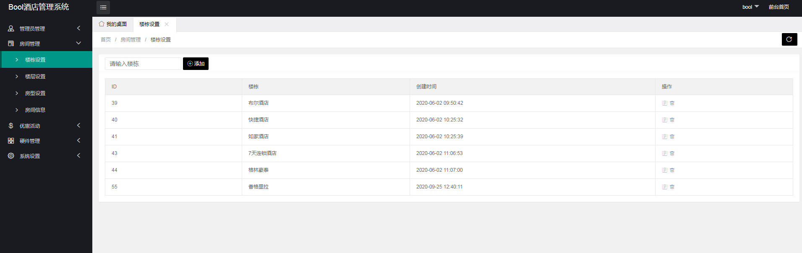

# Hyacinth

## 酒店民宿管理系统beta版

安装手册：
    
    1，sql在根目录hotel.sql
    2.在Nginx低版本中，是不支持PATHINFO的，但是可以通过在Nginx.conf中配置转发规则实现：
    
        location / { // …..省略部分代码
           if (!-e $request_filename) {
                rewrite  ^(.*)$  /index.php?s=/$1  last;
            }
        }
    3.PHP版本推荐7.0+   

## 前台地址 
    http://域名/home/login/index
    前台账号： wode/12345  
    	  dalong/123456
    	  .......
 
## 后台地址 
    http://域名/index/login/index
    后台台账号： bool/12345  

## qq群：285067592

    
  

## 演示

#-----------------------------------------------------------------------------------------------------

# 酒店系统新版本开发中

ThinkPHP 6.0版酒店管理系统
==============================
新版本对系统架构做了进一步的改进，其主要特性包括：

 + 入住管理
 + 预订管理
 + 语音提示、语音播报
 + 房态实时图表数据
 + 预警提示
 + 微信api接口
 + 短信营销
 + 会员管理
 + 酒店的商品管理
 + 报表中心
 + 财务管理
 + 设备管理。智能门锁、读卡器、身份证识别
 
> 系统的运行环境要求PHP7.2以上。
