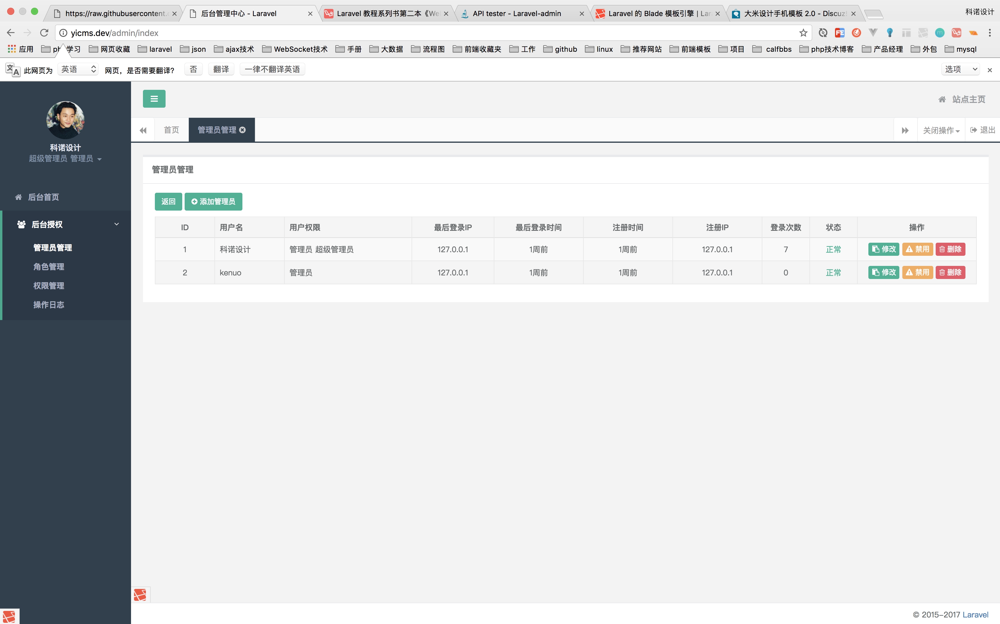
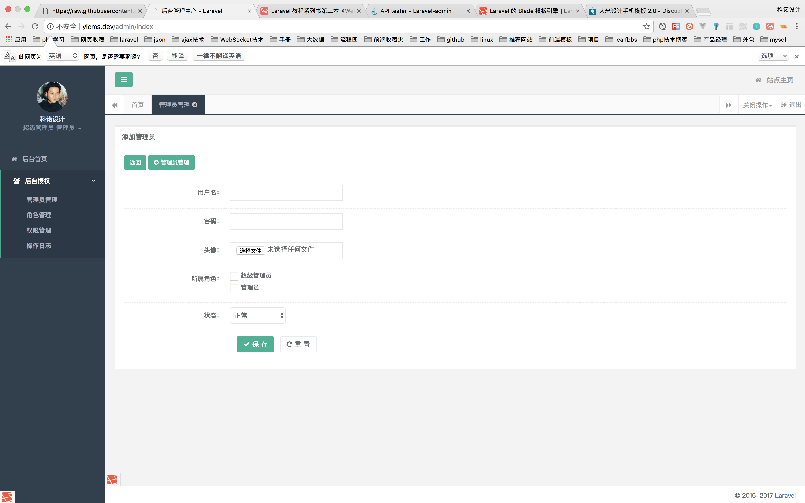
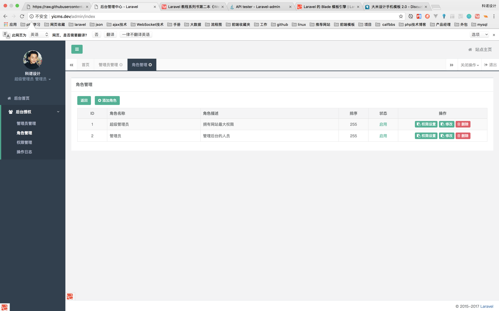
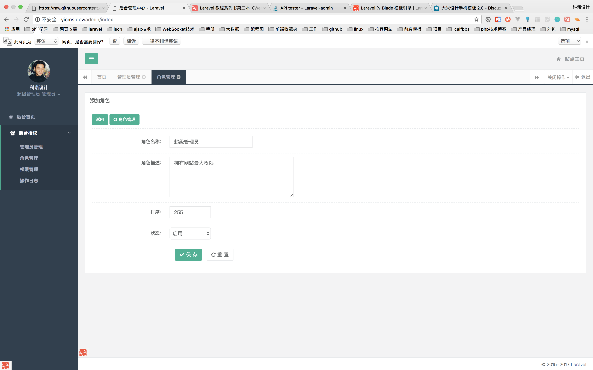
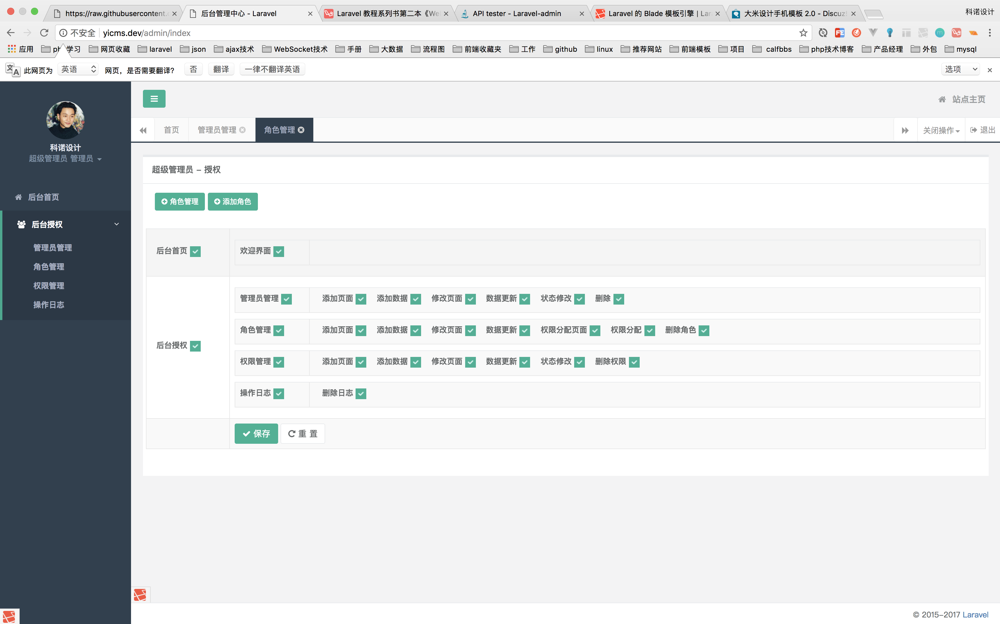
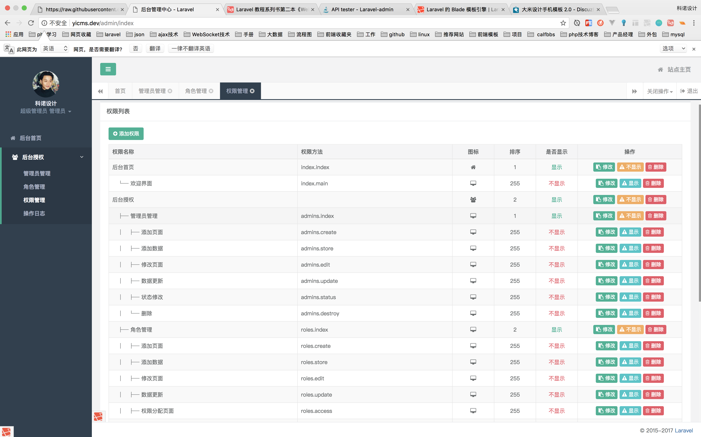
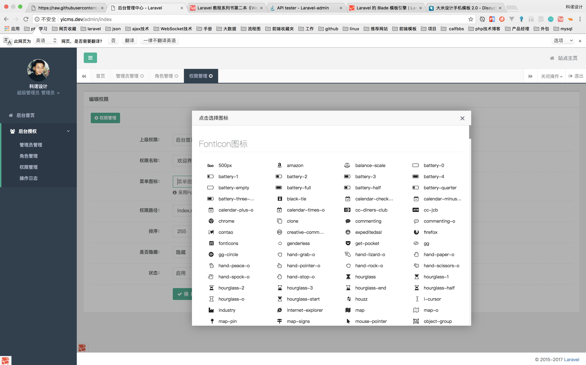
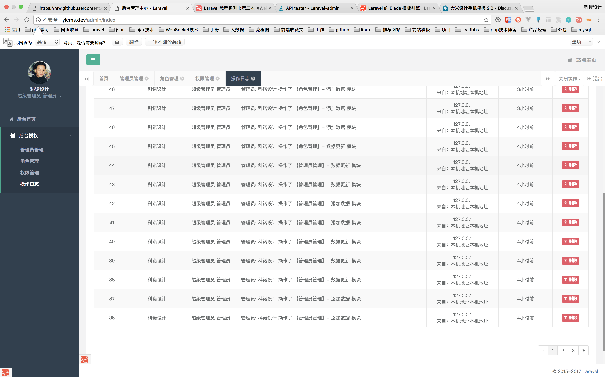

## Laravel-Yicms

[文档](https://jeffreybool.github.io/yicms/)

基于**Laravel5.5** 开发

## 前言
基于 [laravel](http://www.laravel.com/)开发.
后台模板采用 [H+](http://www.zi-han.net/theme/hplus/)

## 功能

### RBAC权限管理
- [x] 中间件 - 判断当前用户是否有权限操作(redis缓存用户拥有的权限)
- [x] 管理员管理 - 添加、编辑、删除、禁用；
- [x] 角色管理 
- [x] 权限管理 
- [x] 操作日志

最终项目界面：

### 管理员管理

### 角色管理

### 权限管理

### 操作日志

## 安装

> 目前为YICMS 1.0版本

### 1.克隆源码到本地
> git clone https://github.com/kenuocn/yicms.git

### 2.进入项目目录
> cd yicms

### 3.给目录权限
> chmod -R 777 storage bootstrap

### 4. 拷贝`.env`文件
一些 `secret key` 改成自己服务的`key`即可
> cp .env.example .env

### 5. 生成秘钥
> php artisan key:generate

### 6.  生成数据表
> php artisan migrate 

### 7. 安装扩展包依赖
下载`laravel`相关依赖的包
> composer install

### 8. 导入根目录下的sql文件

### 9.链接入口
> 管理后台：http://yicms.dev/admin/login

至此, 安装完成 ^_^。
