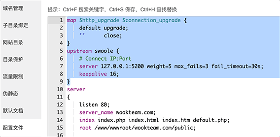

# 安装到宝塔教程

> 此教程是在`Centos 7`下安装的宝塔面板。

- [安装教程(Docker)](DOCKER.md)
- [安装教程(服务器)](SERVER.md)
- **安装教程(宝塔面板)**

## 安装设置

### 1、安装宝塔控制面板

请移步至宝塔官方 https://www.bt.cn/

### 2、安装软件

> 请在宝塔面板内安装一下软件

- Nginx
- MySQL-5.7+
- PHP-7.3+
- PM2管理器

安装完以后打开`PHP`设置安装`fileinfo`、`Swoole4`扩展及删除禁用函数`pcntl`、`putenv`、`proc_open`、`popen`。

### 3、创建配置网站

- 打开宝塔控制面板
- 创建网站之前先创建一个`mysql`数据库（建议类型：`utf8mb4`）
- 创建一个站点（比如域名: `wookteam.com`，根目录：`/www/wwwroot/wookteam.com`）
- 将`wookteam`项目文件上传至此站点目录下
- 重命名文件`.env.example`为`.env`并修改以下参数：

```dotenv
DB_CONNECTION=mysql
DB_HOST=127.0.0.1
DB_PORT=3306
DB_DATABASE=数据库名称
DB_USERNAME=数据库用户名
DB_PASSWORD=数据库密码
```

- 网站目录`运行目录`改为`public`
- 网站配置顶部加上：

```
map $http_upgrade $connection_upgrade {
    default upgrade;
    ''      close;
}
upstream swoole {
    # Connect IP:Port
    server 127.0.0.1:5200 weight=5 max_fails=3 fail_timeout=30s;
    keepalive 16;
}
```

如下图：



- 网站伪静态设为：

```nginx
location / {
    try_files $uri @laravels;
}

location =/ws {
    proxy_http_version 1.1;
    proxy_set_header X-Real-IP $remote_addr;
    proxy_set_header X-Real-PORT $remote_port;
    proxy_set_header X-Forwarded-For $proxy_add_x_forwarded_for;
    proxy_set_header Host $http_host;
    proxy_set_header Scheme $scheme;
    proxy_set_header Server-Protocol $server_protocol;
    proxy_set_header Server-Name $server_name;
    proxy_set_header Server-Addr $server_addr;
    proxy_set_header Server-Port $server_port;
    proxy_set_header Upgrade $http_upgrade;
    proxy_set_header Connection $connection_upgrade;
    # "swoole" is the upstream
    proxy_pass http://swoole;
}

location @laravels {
    proxy_http_version 1.1;
    proxy_set_header Connection "";
    proxy_set_header X-Real-IP $remote_addr;
    proxy_set_header X-Real-PORT $remote_port;
    proxy_set_header X-Forwarded-For $proxy_add_x_forwarded_for;
    proxy_set_header Host $http_host;
    proxy_set_header Scheme $scheme;
    proxy_set_header Server-Protocol $server_protocol;
    proxy_set_header Server-Name $server_name;
    proxy_set_header Server-Addr $server_addr;
    proxy_set_header Server-Port $server_port;
    # "swoole" is the upstream
    proxy_pass http://swoole;
}
```

### 4、编译项目

- 进入服务器，依次运行一下命令：

```bash
cd /www/wwwroot/wookteam.com
composer install
php artisan key:generate
php artisan migrate --seed

npm install
npm run production
```

> 如果提示`npm: command not found`请重启服务器或者运行`source ~/.bash_profile`后再试

### 5、安装配置Supervisor

- 进入服务器，依次运行一下命令：

```bash
yum install -y supervisor
systemctl enable supervisord
systemctl start supervisord
```

- 新建文件`/etc/supervisord.d/wookteam.ini`，内容如下：

```ini
[program:wookteam]
directory=/www/wwwroot/wookteam.com
command=php bin/laravels start -i
numprocs=1
autostart=true
autorestart=true
startretries=3
user=root
redirect_stderr=true
stdout_logfile=/www/wwwroot/wookteam.com/%(program_name)s.log
```

- 运行以下命令：

```bash
systemctl restart supervisord
```

到此安装完毕，希望你使用愉快！

## 默认账号

- admin/123456
- system/123456

## 升级更新

**注意：在升级之前请备份好你的数据！**

- 将最新的代码上传至站点；
- 进入服务器，切换至站点目录，然后依次运行以下命令：

```bash
composer update
php artisan migrate

npm install
npm run production

systemctl restart supervisord
```
