## Conero(Doeeking_V2)
* 起始时间：2016年10月31日 星期一 (将暂停Doeeking代码的更新)
* 截止时间：
* 语言以及框架： PHP/ThinkPHP5.0.3
* 数据库： MySQL
* 前框
    jQuery+Vue/React+ Bootstrap V.3.3.7
* [官网](http://doee.oschina.io/doeeking_v2)

## 项目说明
1. 利用TP5.0.2重写Doeeking项目
2. 设计更加模块化
3. 数据库端更多的借助于存储过程/函数等特性
4.  url?mode=IFR iframe模式- 无返回首页，避免窗口循环

  首页app可拖放-可缩减 

## 备忘录或需求分析

1. 地址基础库 -2016年12月24日 星期六
地址处理- 国家/社会
利用网络资源，属于系统中的工具部件之一
2. 自动登入系统功能，实现方案： 
    a. 浏览器端离线保存用户登录数据，比如密码以及用户等，一旦登录系统首页且保存有的就自动验证-完成登录功能
    b. 数据库设计记录表，在验证IP地址以及用户名等以后自动登录系统(a更加安全)

## 算法公示
1. 贷款计算公式/银行股利息计算公式(宏观经济计算公式)
>> 
    . 贷款计算公式
    1>
     年份 y; 
     应付利息(总) = 贷款本金*年利率*年限 = a
     应付本息 = 贷款本金 + a = b
     首月还款 = b ÷ y*12(月期数)
    2>
     等额本息贷款买房   每月还款额 = [贷款本金×月利率×（1+月利率）^还款月数]÷[（1+月利率）^还款月数－1]     
     计算原则：银行从每月月供款中，先收剩余本金利息，后收本金；利息在月供款中的比例中随剩余本金的减少而降低，本金在月供款中的比例因增加而升高，但月供总额保持不变。

     每月还款额=每月本金+每月本息
     每月本金=本金/还款月数
     每月本息=（本金-累计还款总额）X月利率

## BUG/ ISSUE
* 2016年12月9日 星期五
       网页多级输入框不可编辑?? 
       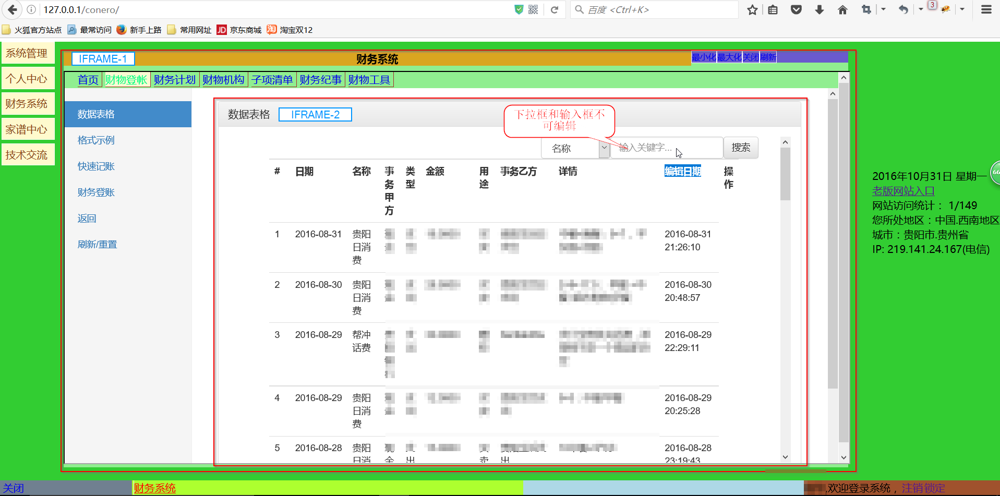
       
       尽量避免多层iframe框； 测试IE有效,firefox/chrome/Edge 均无效
* 2016年12月11日 星期日
       js- bootstrap - 插件/ modal/ pupop /  - document.on('click') 重复绑定 - 代码/图片如： 
       [bug161211](./Doc/conero.full-bug161211.js)
       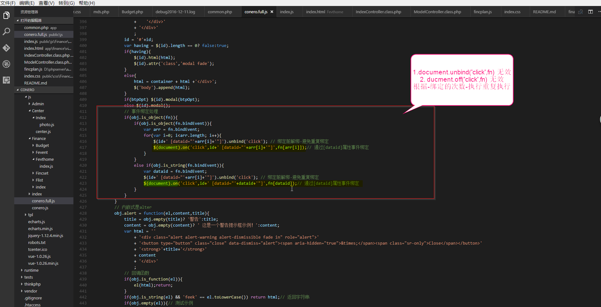
       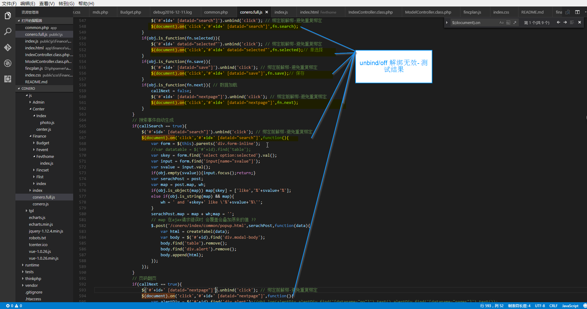
       现象:   点击一次事件重复执行3次/ 第一次生成时有效 - 第1+n次绑定出现bug - 事件累加绑定
       解决方法:   绑定事件之前解绑事件   ?? 测试依然无效
* 2016年12月18日 星期日
       Mysql 数据库， 当某个表拥有复合主键时，其中一个主键被其他表应用时，删除该表中一条复合主键关联数据时被阻止。 同样新增是，可会报错主键已经存。修改是可以
       原因1. 可能是改该表触发器的原因
       解决方法： 新增失败后尝试利用修改补偿bug
       如下图所示:
       >> 新增子账号 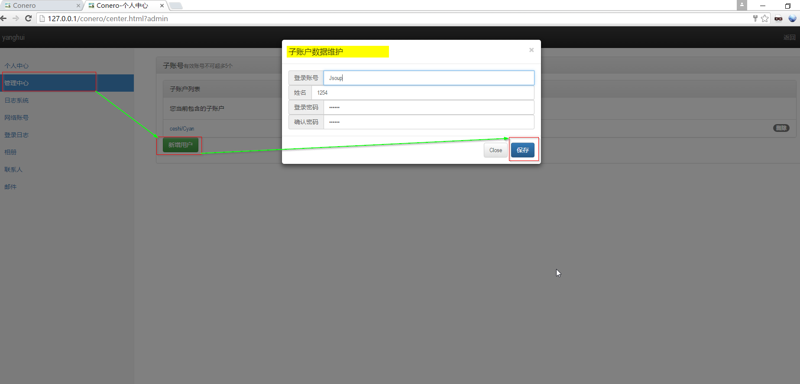
       >> 错误日志 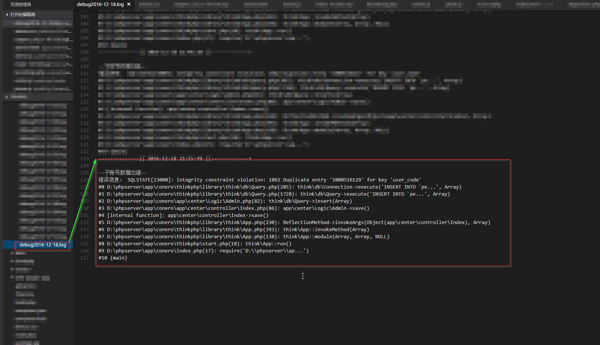
       >> 数据库错误 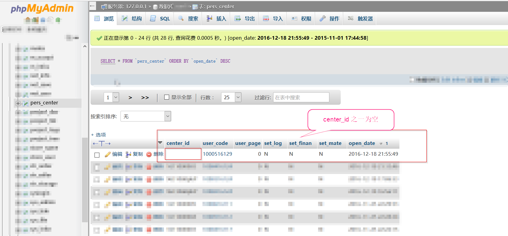
       >> 代码解决方法 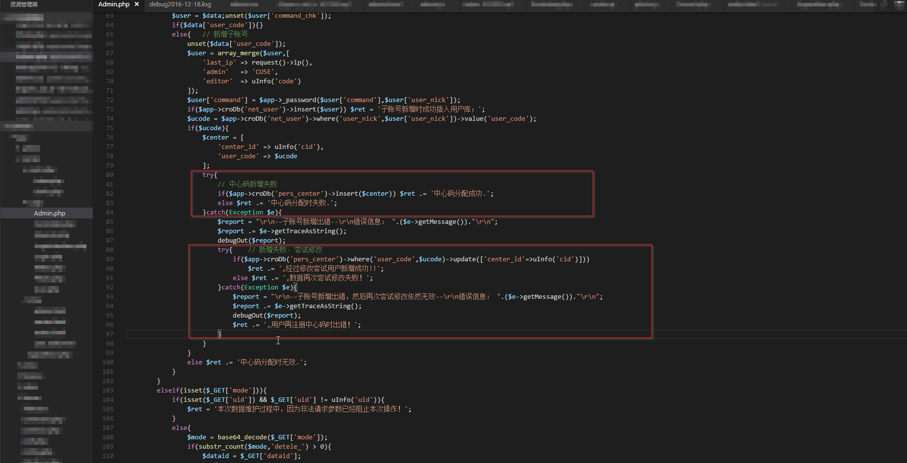
* 2016年12月30日 星期五
       Conero.full.js  pupop控件换页无效(重复加载数据)
* 2016年12月30日 星期五
       MySQL 新增数据时无法获取到- 当前列的数据ID- 如触发器构造的数据。 仅仅可获取到自动增加的值
* 2017年2月16日 星期四 PHP语言函数
       使用 is_callback($value) 判断为一个变量时，且该支字符串刚刚和系统一函数一致时，系统会执行函数从而出错
       是使用 $value instanceof Closure 判断可以正常显示
       是使用 $value instanceof Closure 判断可以正常显示
       如下图所示:
       >> 系统菜单管理 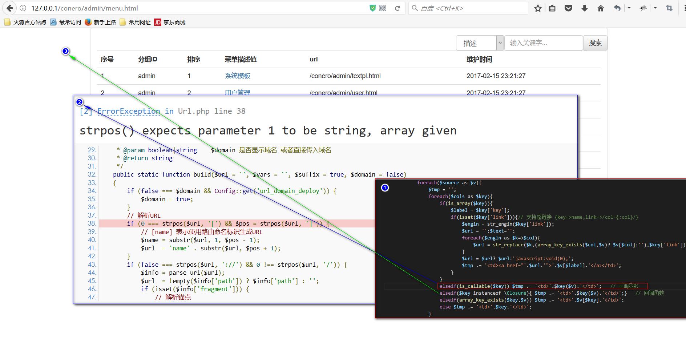

## ThinkPHP5/PHP 笔记

* 数据查询   find()/value()  分别获取单列/单值数据
* PCRE 参考手册正则表达式参考

#### PHP 包

1. Buzz-PHP     轻量级PHP的 HTTP客服端库
2. Requests     PHP 的 http 库

## CONERO/财务系统-Finance 

* 财务纪事
    财务系统中一个事务 -> 财务账单- 财务计划 - 操作日志
    js处理时间可能错误提交-污染数据- 提交一次提交按钮会可能重复提交多次-数据感染 -> bootstrap 插件使用(popup/搜索框) - 事件采用 - $(document).on('clik') 一旦元素生成后导致重复绑定事件 - 解决方法是绑定之前进行事件解绑  

* 财务预算- finc_budget -> finc_plan    (1->n)
    finc_budget 可提供模板， finc_plan 为具体的明细
    finc_budget name 可自动自动生成
* 财务登账- finc_set    -> fshop_list   (1->n)

* 效果截图
 财务登账数据维护图-信息控制台
 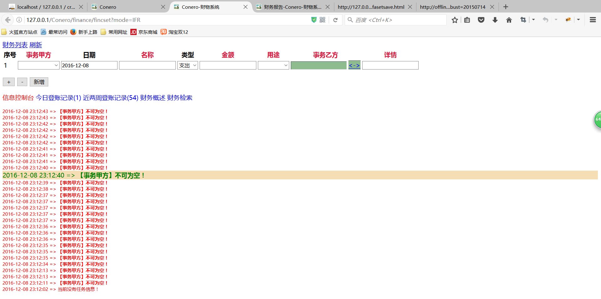
 财务登账数据展示- echart + PHP动态展示
   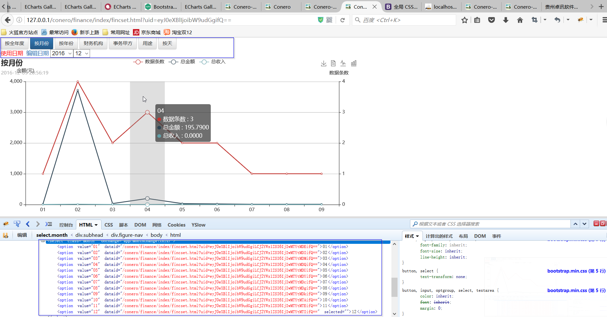

* 财务编号 - 年月季度等解析 2016-10-00/2016-00-01/2016-00-00

## CONERO/系统管理-Admin

* 效果截图
 个人中心- 相册展示图
   

## CONERO/个人中心-Center
## CONERO/家谱中心-Clan
## CONERO/技术交流-TeCenter - Geek
* 设计方式
    所有页面使用公共-导航栏，以及公共页脚。并且使用 $geekSpecilNavPlus 定制头部菜单，根据不同的项目请求。
    该模块具有访客和用户双重性
    作者名称显示非真实名称而知登录账号
* 取消项目的-复核主键-代码和用户    
## IEAD - 
1. 生活时间轴 - 记录当前的生活记录比如: 驻留城市/ 工作日志记录等   (2016年12月20日)

## nodeServer NodeJS 服务开小应用
@ 2016年12月14日 星期三

#### >> Mustache NodeJS 模板语法
1. {{name}}             赋值 name
    {{&name}}           HTML不转义
2. {{#name}}{{/name}}   区块， name 不为 null/undefined/false 才渲染 类似: {if name 非空}渲染{/if}
    如:
    {{#obj}}
        {{k}}
        {{k2}}
        {{k3}}
    {{/obj}}
    
3. {{^name}}{{/name}}  区块， name 不为 null/undefined/false 才渲染 类似: {if name 空}渲染{/if}
4. {{.}}               枚举， 
    如: 
    {{#name}}<li>{{.}}</li>{{/name}} -> name => [1,5,8,6] => <li>1</li><li>.</li>...
5. {{<partials}}        子模块
6. {{{name}}}           输出 HTML
7. {{!name}}            模板注释

#### >> socket.io
1. [socket.io](https://github.com/socketio/socket.io)
2. [socket.io-client](https://github.com/socketio/socket.io-client)
3. [qr-image](https://github.com/alexeyten/qr-image)

## 项目日志

*  2016年11月5日 星期六
    从老版系统备份数据库> cro2
    - jc[brximl@20161105] - 全局权限才能够登录

*  2016年11月9日 星期三
    ?? 首页刷新以后触发保存事件    

*  2016年11月10日 星期四
    Index/Appsh- 系统模块化处理/应用入口| 分发app子页面

* 2016年11月16日 星期三
    1. 财务计划-> 可选当月账单： 分两个模块- 年季度月/时间计划    
    2. 考虑系统采用缓存技术
* 2016年11月19日 星期六
    修改对个用户对应一个财务中心ID: userId <-> centerId (1:n)  子用户概念
* 2016年11月22日 星期二
    新增>>
    1. app应用可保存iframe页面，减少服务器的访问速度，并且用刷新数据更新
    2. app应用样式进行美化，tab效果优化等   

* 2016年11月29日 星期二
        财务纪事- 
        可实现财务系统中最小的实例。 通过 related_fn = table.id = value
        若具备财务实例条件时，不可马上删除，需要在七天内确认删除才行(删除确定) 
    财务登账快速记账: 示例 
        (2016-11-29: 生活购物)[现金 : 500 -> 沃尔玛]{备注}
        (日期: 名称)[事务甲方 : 金额 -> 事务甲方]{类型|备注}

        select concat("(",use_date," : ",name,")[",master," : ",figure,">",sider,"]{",explanin,"}") as tpl from finc_setview
* 2016年12月2日 星期五
       首页模板-应用分离 以实现多模板控制   

* 2016年12月3日 星期六
       系统日志使用原来的备忘机制扩展实现     

## SVN 更新日志

* svn_V30 2016年12月12日 星期一(周末代码) 
 
>> 个人中心-模块新增-(center)
       架构：采用 center/controller/Index.php 的 index 操作来继承模块化处理，所有页面共享一个主界面，式布局与后台业务逻辑分开， Logic/Controller.php - 等文件提供业务逻辑支持。 url设置为 /conero/center?user {/conero/center?业务逻辑方法名}, Controller采用接口等概念。
       应用： 用户基本信息/相册 - User/Photo
>> conero.full.js 框架bug修复- 发现 bootstrap 插件在事件绑定打上存在重复绑定的问题，造成一次触发时间多次运行的象征， 在财务纪事中出现点击一次修改多条数据更变成一样的
       解析：  绑定事件以前先解绑
>> 财务系统
       财务纪事- Fevthome 完场后台数据支持
>> 系统管理
       信息系统常量- Sconst 模块的信息展示界面
>> 数据库进行了适应新改变
 

* svn_42 2016年12月14日 星期三
 
>> 新增 nodeServer 节点 - 用于 sokect.io + NodeJS 的应用 ，用于实现手机端快速登录以及数据导入
 

* svn_43 2016年12月18日 星期日
 
1. >> 系统管理
     优化【系统管理】模块， 利用之前的boostrap类 对也页数据列表增加搜索功能
     新增用户“文件一览”节点
2. >> 用户/个人中心
     完善联系人/子账户的数据增删改查支持
     根据此项的需求， conero.full.js 库新增了 confirm 确认框
     根据此项的需求， conero.full.js 库完成 多记录新增控制
3. >> 其他
     Bootstrap 代码优化以及其他
4. >> 时间
     周末 - 两天， 花费时间在8小时左右

* svn_47 2016年12月20日 星期二

1.    系统优化- 通过测试出来的bug。 具体包括： 注册页面UI调整
2.    财务账单适应性调整 - 由于系统增加了子账号的概念， 而财务账单会因为仅仅依赖中心ID而出现重复显示， 采用个人代码来区分。 修改财务登账模块以及后台数据库存储过程 - 
3.    nodeServer 项目实现优化等/ nodeServer 项目由于使用 socket.io 具有专用性,所以把代码转移为 nstart 项目- Node web 框架第二版

* svn_48 2016年12月23日 星期五

    个人中心- 编辑页面采用模块化程序设计

* svn_49 2016年12月25日 星期日
 
1. 网站全局 
       首页在原来的基础上新增- bootsrap 风格发界面， 即将首页界面可扩展处理。将原来的模式设为 默认方式。 未这中改变更变后台处理
       设计 bootsrap 风格发界面， 以及为适应变革新增 系统管理重新设计二级主页菜单
       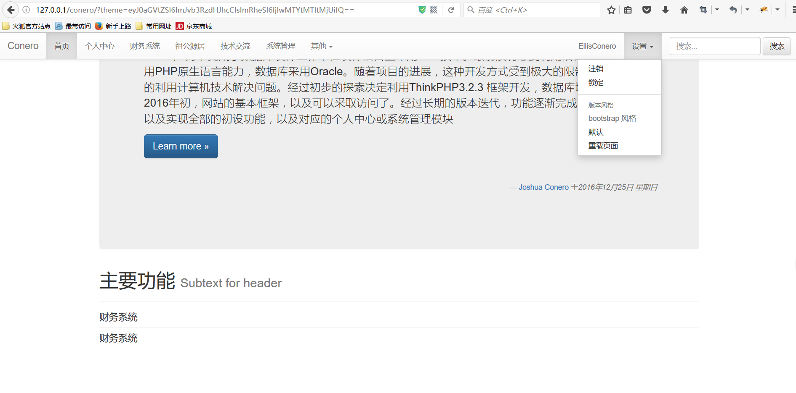
       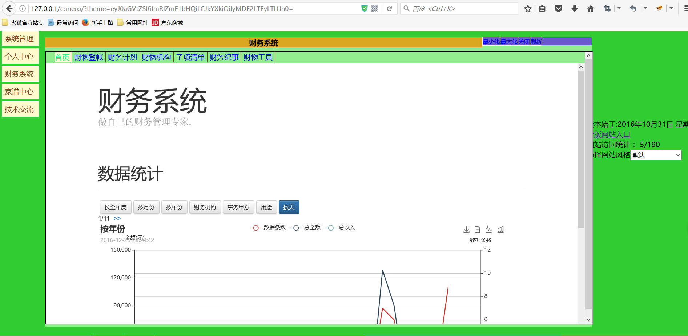
2. 个人中心
       账号管理 - 设计提交表单(后台支持未完成)
       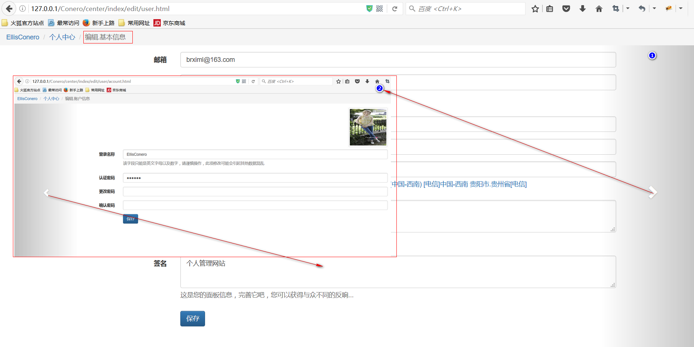
3. >> 其他
     同服务器不同端口号页面动态生成

* svn_50:51 2016年12月27日 星期二
1. 系统管理
       设计“系统常量”模块的数据维护界面
       优化【系统管理】应用界面， 设计首页
      系统常量后台增删改查支持完成； 编写 sys_site 触发器等
      新增数据模块- 系统信息发布模块
2. conero.full.js 
       formListEvent 方法新增 提交前的控制，以及其他优化
       this.extends 设置为 继承 conero的子类
       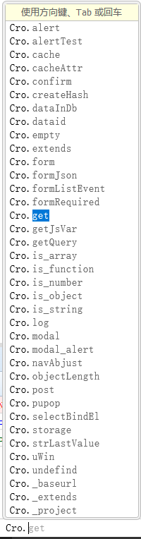
      formListEvent 方法控制优化， 可以记录删除的记录，并发送到后代
      pupop窗等控制
3. 财务系统
       应用首页 bootsrap风格设计

* svn_53 2016年12月30日 星期五
1.  网站全局
       新增 “geek” 技术交流中心
       新增 “clan” 祖公源居(家谱信用)
       hyang 库扩展 - hyang\FrontBuild 用于编译 js 脚本- 利用PHP完成脚本控制
2. 模块更变
       【个人中心】模块 新增“项目”节点
       【技术交流中心】模块 完成项目的整体布局
3. 引入插件
        jtree/bootstrap-datetimepicker 开源库-用于生产树形/数据选择器等

* svn_54/55 2017年1月4日 星期三
1.  网站全局
       系统新增-“自动登录识别登录功能” - 具体方法是- 根据浏览器端的数据执行自动登录
2. geek/技术交流
       【计算机语言】节点新增 - 用于跟踪或研究当前的语言以及相关的计算机科学。 提供普通的数据维护操作
       新增数据表“gk_lang” 用于后台数据的支持
3. 系统管理
       【Lisa】模块新增- 同个 “技术交流/项目管理”映射当前系统，用于记录或者配置系统模块等。以及作为系统开发日志记录等
4. 其他
       conero.full.js 完善- extends 函数用户继承父类以及未特也页面系统沙箱支持
       其他程序优化
* svn_56/59 2017年1月9日 星期一
1. 财务系统
       财务预算(例行部分实现)，主要功能更有- 例行财务数据的基本维护(增删改支持)，以及财务数据可视化更新等
       财务登账-登账页面改造- 保留原来的非bootstrap风格，新增同能类似的 bootstrap 页面。 布局多列表的数据，使用panel面板元素，可对功能进行模块化继承。
            样式示例如: -20170108-01.png)
            样式示例如: -20170109-01.png)            
       财务系统首页模块- 新增应用页面跳转， 应用页面刷新等按钮操作
2. conero.full.js 
       新增 - progressGrid 动态进度条控件
            代码示例如: 
            代码示例如: 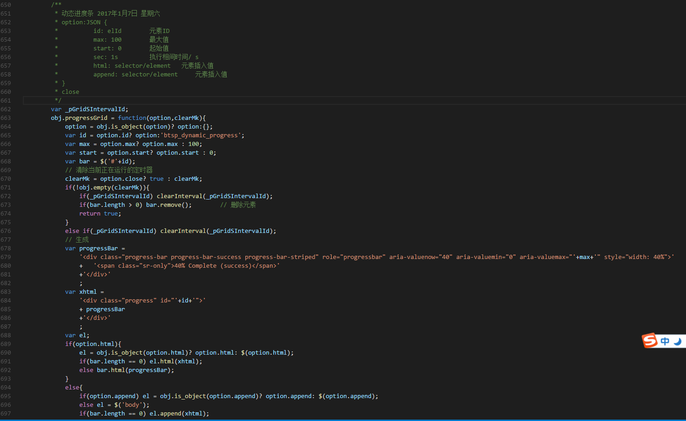
