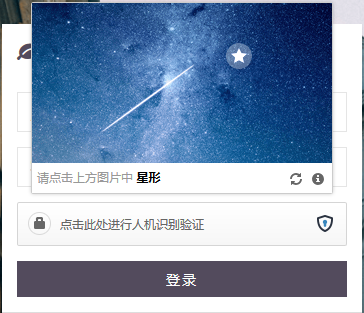

# yii2-luosimao-captcha

Luosimao 创新开发的人机验证，免去了复杂的输入过程，具有更加优秀的操作体验，更加美观的设计，可更好地融入到您的网站中

官网地址：https://luosimao.com/service/captcha

> 效果



> 安装

```
 composer require dungang/yii2-luosimao-captcha
 
```

> 使用

配置,params.php,这里的key需要到官网注册免费。这里只是随机字符串不能使用

```
    'luosimao'=>[
        'apiKey'=>'37612977ac724a1a106547a16a16b9df',
        'siteKey'=>'63d0501aa023bf80361f084a63153d8d'
    ],
```

模型验证规则

```
    [['verifyCode'], 'required'],
    ['verifyCode','dungang\luosimao\CaptchaValidator'],
```

视图 view file

```
    <?= $form->field($model,'verifyCode')->label(false)
    ->widget('dungang\luosimao\CaptchaWidget')
    ?>
```

> 协议

MIT License

Copyright (c) 2017 顿刚

Permission is hereby granted, free of charge, to any person obtaining a copy
of this software and associated documentation files (the "Software"), to deal
in the Software without restriction, including without limitation the rights
to use, copy, modify, merge, publish, distribute, sublicense, and/or sell
copies of the Software, and to permit persons to whom the Software is
furnished to do so, subject to the following conditions:

The above copyright notice and this permission notice shall be included in all
copies or substantial portions of the Software.

THE SOFTWARE IS PROVIDED "AS IS", WITHOUT WARRANTY OF ANY KIND, EXPRESS OR
IMPLIED, INCLUDING BUT NOT LIMITED TO THE WARRANTIES OF MERCHANTABILITY,
FITNESS FOR A PARTICULAR PURPOSE AND NONINFRINGEMENT. IN NO EVENT SHALL THE
AUTHORS OR COPYRIGHT HOLDERS BE LIABLE FOR ANY CLAIM, DAMAGES OR OTHER
LIABILITY, WHETHER IN AN ACTION OF CONTRACT, TORT OR OTHERWISE, ARISING FROM,
OUT OF OR IN CONNECTION WITH THE SOFTWARE OR THE USE OR OTHER DEALINGS IN THE
SOFTWARE.
