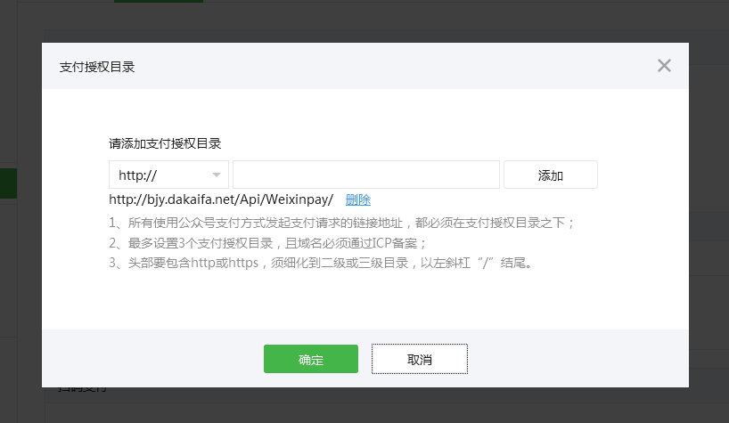
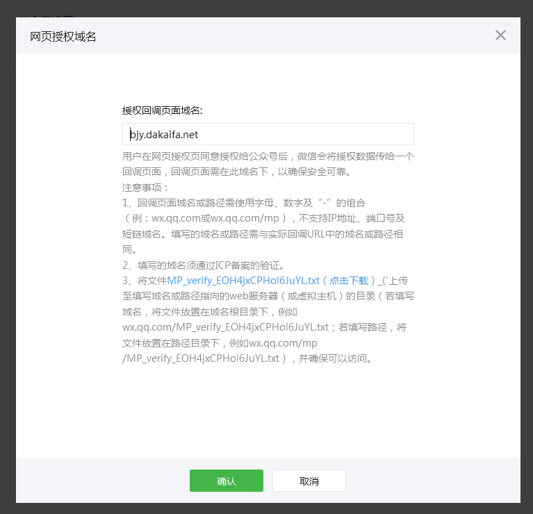
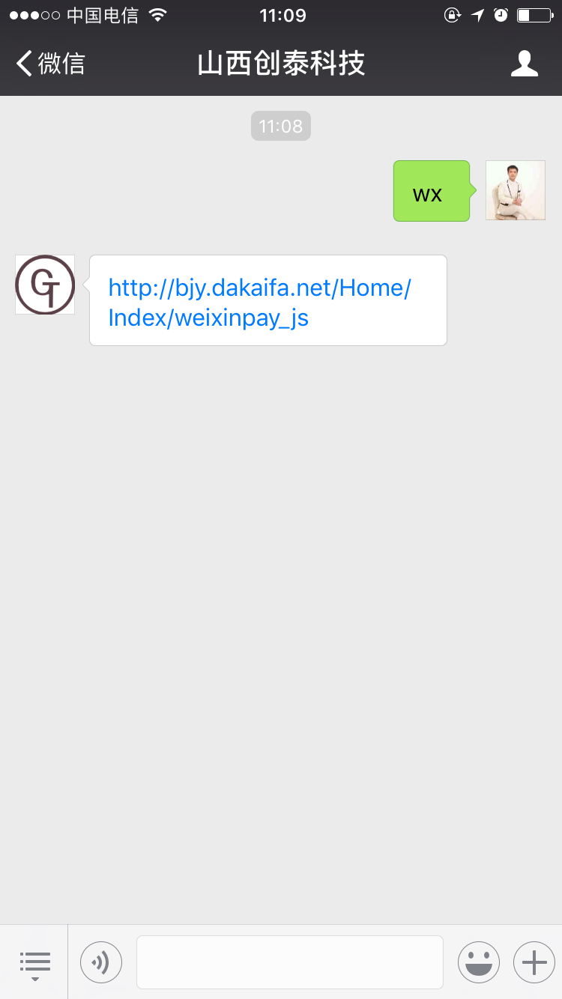
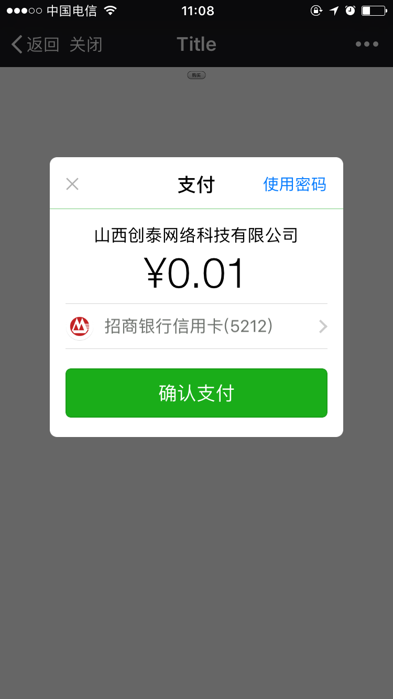

#微信公众号支付

## 1、文件结构
```
├─Application
│  ├─Api
│  │  ├─Controller
│  │  │  │─WeixinpayController.class.php    微信公众号支付
│  │  │  │  │─public function notify()      notify_url接收页面
│  │  │  │  │─public function pay()         公众号支付
│  ├─Common
│  │  ├─Conf
│  │  │  │  │─config.php    配置文件
│  │  ├─Common
│  │  │  │─function.php
│  │  │  │  │─function curl_get_contents($url)  使用curl获取远程数据
│  ├─Home
│  │  ├─Controller
│  │  │  │─IndexController.class.php    微信公众号支付
│  │  │  │  │─public function weixinpay_js      支付跳转
├─ThinkPHP
│  ├─Library
│  │  ├─Vendor
│  │  │  │─Weixinpay
│  │  │  │  │─Weixinpay.php 微信支付类
├─tpl
│  ├─Api
│  │  ├─Weixinpay
│  │  │  │─pay.html  支付页面
├─.htaccess 伪静态设置
├─MP_verify_EOH4jxCPHol6JuYL.txt    微信支付根目录需要安装的文件（根据微信支付提示来设置）
```

## 2、说明

微信支付是不需要证书的，只有退款和红包才会使用证书！

应该使用URL模式的 rewrite ，这一点特别注意！


## 3、图片



微信配置-支付授权目录



微信配置-网页授权域名



微信使用-微信公众号支付链接



微信使用-微信公众号支付界面