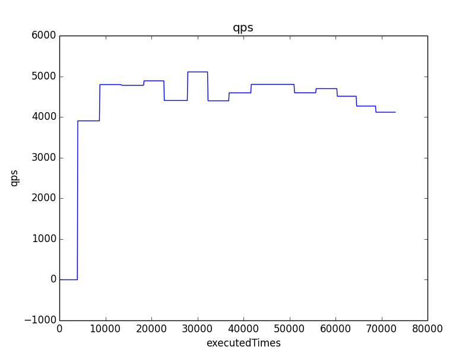

# php-stress-tester

[](https://travis-ci.org/luoxiaojun1992/php-stress-tester)

## Description
A simple stress tester based on swoole coroutine.

## Requirements
1. Swoole2.1.0+ (编译时请添加参数 --enable-openssl --enable-coroutine)
2. PHP7.1+
3. 勿同时安装opencensus扩展，经测试有内存泄漏问题

## Usage
```shell
# GET
php start.php -c 100 -n 1000 -host www.baidu.com -uri / -port 443 -ssl 1 -step 1

# POST
php start.php -c 100 -n 1000 -host www.baidu.com -uri / -port 443 -ssl 1 -step 1 -http_method POST -http_body {\"foo\":\"bar\"}

# PUT
php start.php -c 100 -n 1000 -host www.baidu.com -uri / -port 443 -ssl 1 -step 1 -http_method PUT -http_body {\"foo\":\"bar\"}

# DELETE
php start.php -c 100 -n 1000 -host www.baidu.com -uri / -port 443 -ssl 1 -step 1 -http_method DELETE -http_body {\"foo\":\"bar\"}

# Help
php start.php -help

# Draw QPS graph
python tools/draw.py ~/php-stress-tester/reports/report_20180601144315278353823169.csv qps 1
```
## Output
```shell
测试中...
最大请求并发: 100
请求并发: 100
请求总数: 1000
平均耗时: 41.335484266281毫秒
最大耗时: 165.99607467651毫秒
最小耗时: 25.51007270813毫秒
成功请求总数: 1000
成功率: 100%
成功平均耗时: 41.335484266281毫秒
成功最大耗时: 165.99607467651毫秒
成功最小耗时: 25.51007270813毫秒
失败请求总数: 0
失败率: 0%
失败平均耗时: 0毫秒
失败最大耗时: 0毫秒
失败最小耗时: 0毫秒
实时QPS: 1000
平均QPS: 1000
内存占用: 2012.72KB
```

## QPS Graph


## Arguments
1. -c Concurrency
2. -n Requests
3. -host Hostname
4. -uri Uri
5. -port Port
6. -ssl SSL
7. -step Concurrency Step
8. -http_method HTTP Method
9. -http_body HTTP Body
10. -memory_limit Memory Limit
11. -max_coroutine Max Coroutine
