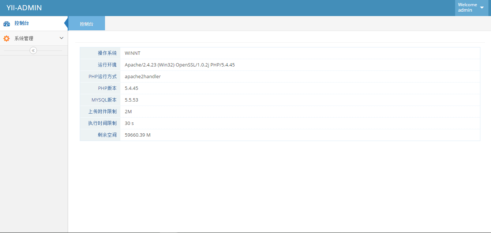
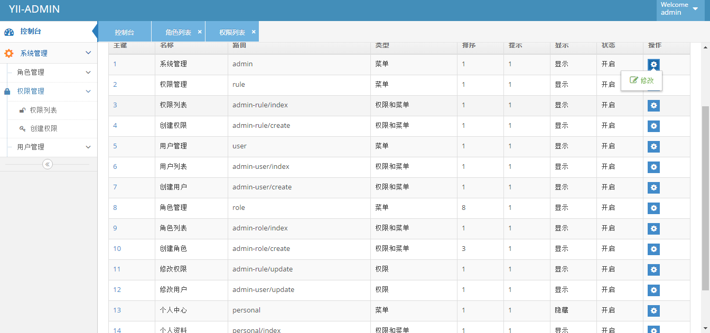
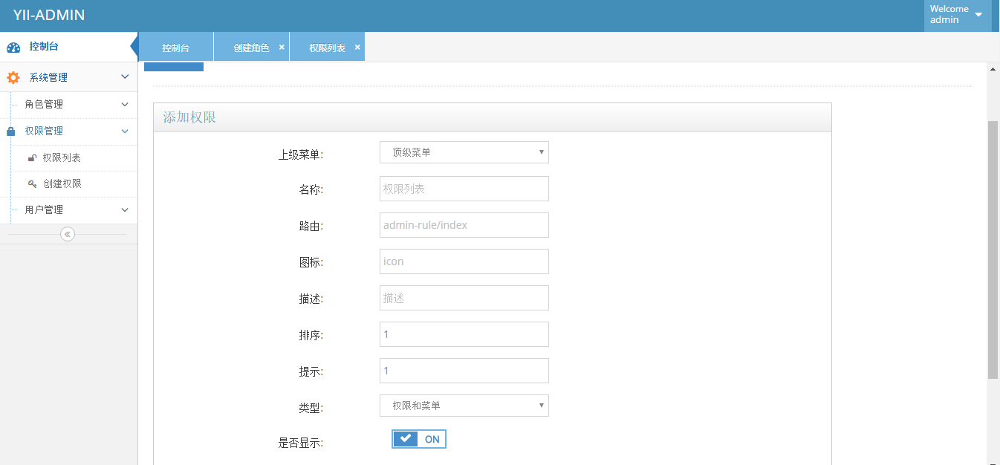
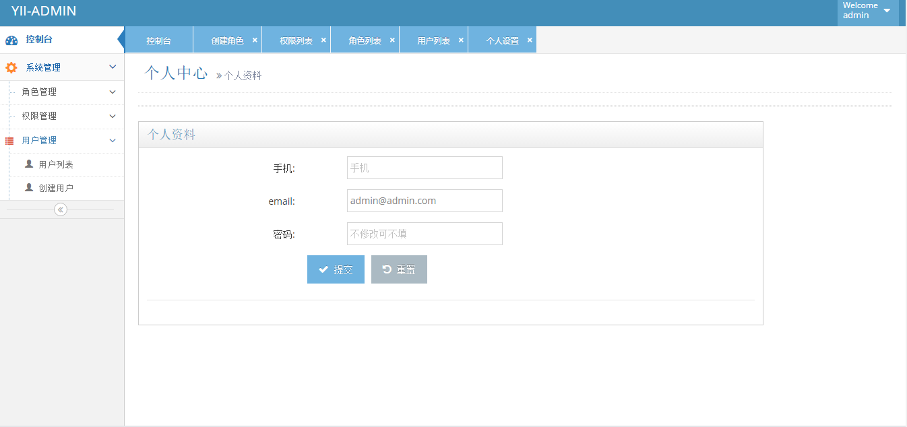

###YII-ADMIN

采用  [yii2](https://github.com/yiisoft/yii2)  + [aceAdmin](https://git.oschina.net/liushoukun/aceadmin.git)  开发的后台管理系统。
包括了用户,角色，权限管理；

[github](https://github.com/doudou1688/yiiadmin.git) [oschina](https://git.oschina.net/liushoukun/yiiadmin.git)
###项目说明

>此项目只是一个后台系统，并无前台，请根据自己的业务需要进行添加

###项目图片

###安装说明
>需要先 `composer install` 安装yii2

 - 1.设置 cookieValidationKey  `/backend/config/main.php:54`
 - 2.数据库导入 `/doc/yiiadmin.sql`
 - 3.修改数据库链接配置 `/backend/config/main.php:15`
 - 4. 配置完成 访问地址: `backend/web/index.php`   默认管理员：admin     密码； 123456

没有安装composer,完整版下载 [http://pan.baidu.com/s/1jIJlufG 密码: 6wqh](http://pan.baidu.com/s/1jIJlufG)

欢迎大家一起来学习！
 