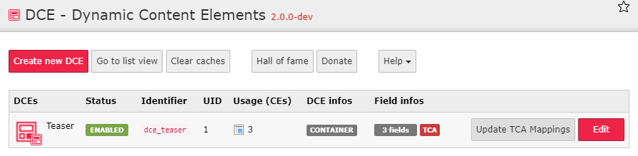

.. include:: ../Includes.txt

.. _additional-informations-backend-module:

The DCE backend module
----------------------

Under **Admin Tools** in the main navigation of TYPO3 backend you find "DCE" which leads to this dashboard:

Dashboard
~~~~~~~~~

On the dashboard, you see all DCEs you have created.

.. hint::
   DCEs are TCA records stored on pid=0 (root level)

You see pieces of information for each DCE:

- Status (enabled/disabled)
- Identifier
- ``uid``
- Usage (amount of content elements using this DCE)
  - click on it, to see more details

    .. image:: Images/content-references.png
       :alt: Content elements using this DCE

- Infos about features used, like DCE container, TCA mappings
- Amount of fields used in this DCE

Also when you have mapped values to TCA columns of tt_content, you get an **Update TCA Mappings** button,
which updates the values of mapped columns, by given FlexForm values.

More stuff
~~~~~~~~~~

In the backend module, you also find helpful links to Documentation, Facebook page, etc.

Also, you can clear the system caches, switch to list view and create and edit DCEs.

You can donate and see other donators in the hall of fame.
