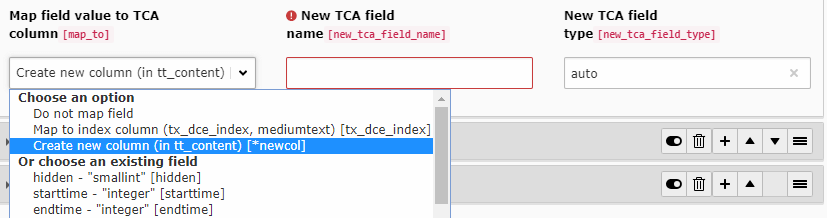

.. include:: ../Includes.txt

.. _additional-informations-tca-mapping:

TCA Mapping
-----------

Since DCE 1.2 you are able to map the field values of your DCEs to tt_content columns.
DCE is also able to create new columns if necessary.

When creating new columns the following options have the following effect:

- **New TCA field name:**
  Name of the column in database and TCA. You are free to choose the name. Nothing gets prepended.
  It is recommended to ``use_underscores`` instead of ``usingCamelCase``.
- **New TCA field type:**
  This is the type of field in the database. Example: ``varchar(255) DEFAULT '' NOT NULL``.
  You can also use the keyword ``auto``. DCE will choose a proper SQL field type based on chosen configuration type in
  FlexForm.

Of course, you can also choose an existing tt_content column. DCE introduced the **tx_dce_index** column which can get
used to index content for search engines (like ke_search or solr).

.. note::
   Since DCE 2.2, contents of DCE fields which has been mapped with "tx_dce_index", are also searched for when using
   the global LiveSearch in TYPO3 backend. Since TYPO3 9.2 the search in list view, also respects "tx_dce_index"
   contents.

When you point two DCE fields (or more) to the same TCA column, the contents of the field become appended
(by 2x ``PHP_EOL``).

Every time you change a content element based on DCE with TCA mappings, the TCA values will get written,
when saving/creating the content element.

If you want to update the values, you can call an update script (Update TCA mappings) in DCE backend module.
