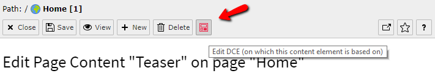
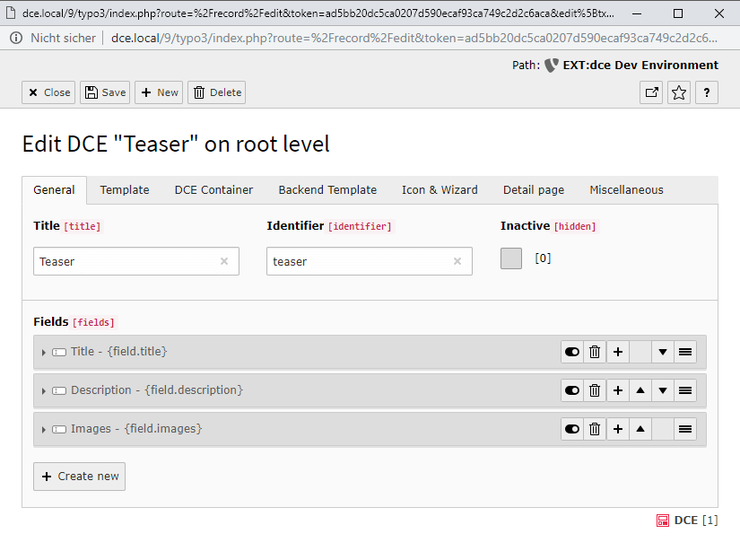

.. include:: ../Includes.txt

.. _administrator-manual-edit-dce-button:

Edit DCE button
---------------

In the backend, when you are logged in as administrator, you can access the configuration of a content element based on
DCE, right inside the content element itself:

When you click on it, a popup appears which allows making changes for the current DCE:

