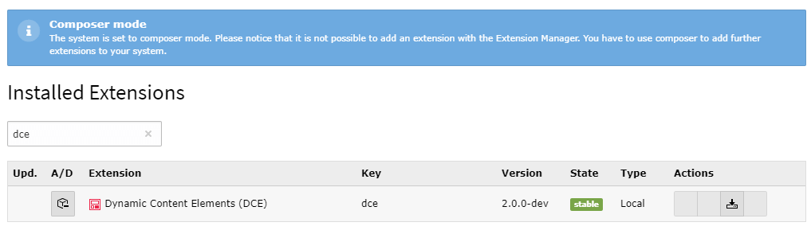

.. include:: ../Includes.txt

.. _administrator-installation:

Installation
------------

You can install DCE with or without composer.

With composer
~~~~~~~~~~~~~

Just require DCE on cli:

::

    $ composer req t3/dce:"^2.0"

When composer is done you need to enable the extension in the extension manager.

Without composer
~~~~~~~~~~~~~~~~

You can also fetch DCE from `TER <https://extensions.typo3.org/extension/dce/>`_ and install it the old-fashioned way.

.. tip::
   You need to enable the extension in Extension Manager with or without composer in use!
   Or use CLI tools for that.

DCE provides no further options here.
