.. include:: ../Includes.txt

.. _tutorial:

First steps
===========

In this tutorial, we will create a simple content element with a title, a description and some images.
Later we also enable the DCE Container feature.

.. contents:: :local:

Overview
--------

First, you need to login to TYPO3 backend **with administrator privileges**. Those are required to create or edit DCEs.
Content elements made by DCE can be used with regular editor privileges.

You'll find DCE under "Admin Tools" in the main menu. It shows you a list of all DCEs existing in the database:

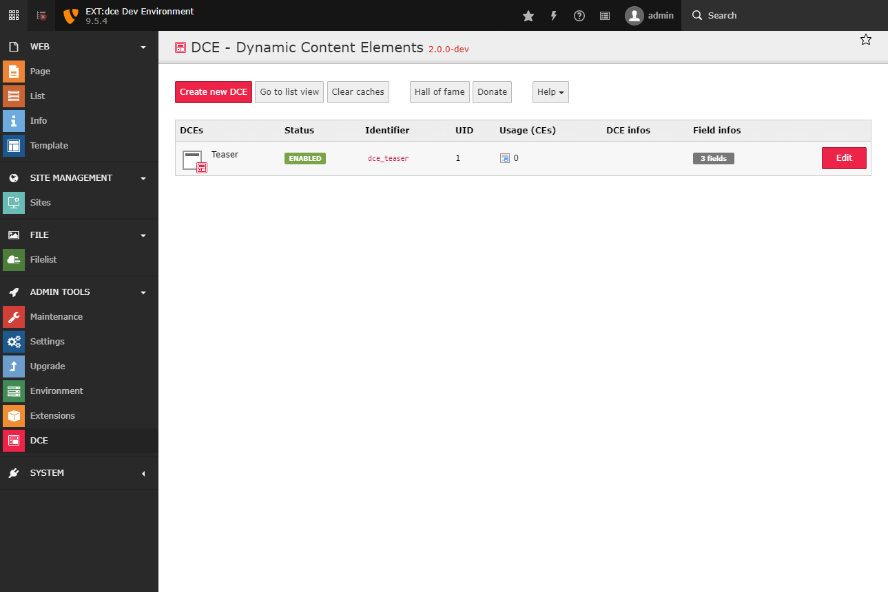

.. note::
   DCEs are stored on root level (pid=0). You can also access DCEs in list view.
   DCE fields are not displayed directly.

Create your first DCE
---------------------

Click the button "Create new DCE" and enter the title of your new dynamic content element. For example: "Teaser".

Also, we set the identifier to "teaser". Later this will be prefixed with "dce\_" and used as CType of this
new content element.

Now create a new field, keep the default type "Element" and enter "Title" as field title.
Set variable to "title".

.. attention::
   Variable names for DCE fields have to be written in **lowerCamelCase**!

As configuration we choose the option "Simple input field" from the dropdown above the code editor.
It pastes a sample configuration with commonly used settings. You should get this output:

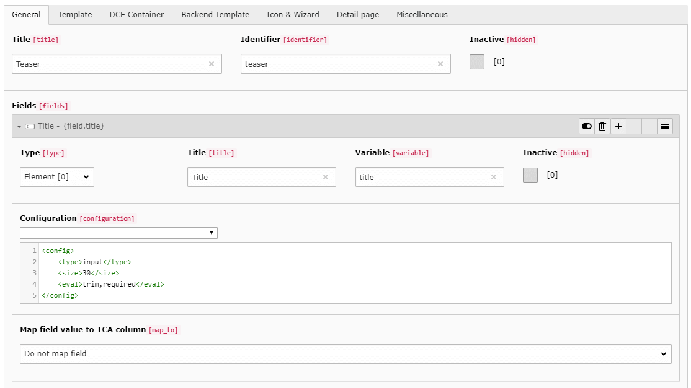

Now, add another new field with the title "Description" and "description" as the variable name. As configuration we use
"RTE" from the dropdown box.

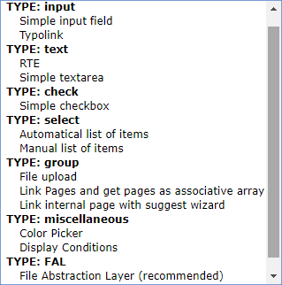

Next, create the last field with the title "Images" and the variable name "images". As configuration we use
"File Abstraction Layer (recommended)" of the type "Inline". The configuration of a FAL media field is pretty complex,
but you also find options like minimum and maximum of images, or which file types should be allowed.

Save the changes. You should see the structure of your first DCE:

.. image:: Images/first-dce.png
   :alt: Your first DCE

Now, when you **clear the system caches**, you can already use the content element on your pages:

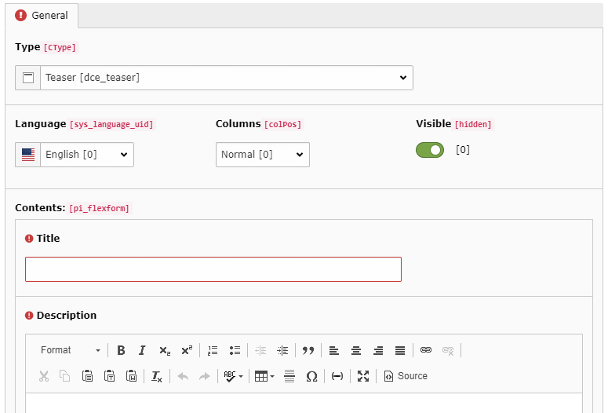

Frontend Templating
-------------------

Let's return to your Teaser DCE and switch to tab "Template".
You see a default template, which will be output in frontend for each instance (content element) of this DCE.

.. image:: Images/template-default.png
   :alt: The inline template editor, with the DCE default frontend template

In this editor, you can define what TYPO3 should display, right in place. You can also load template files if you want.

The dropdown above the template field shows different items you can choose from. It displays the fields you have
defined and some other very helpful stuff:

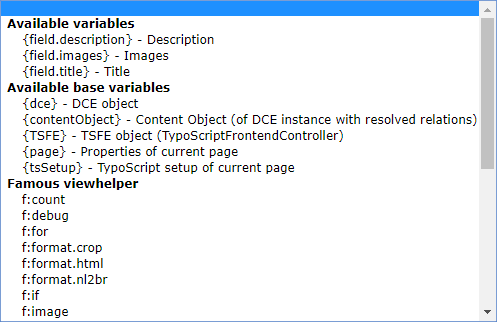

Now, we build the frontend output that we want, for each content element based on this DCE.
The template engine here is Fluid:

.. code-block:: html

  

      <h2>{field.title}</h2>
      
<f:format.html>{field.description}</f:format.html>

      <f:for each="{field.images}" as="image" iteration="iterator">
          <f:image image="{image}" alt="{field.title}" width="100" />
      </f:for>
  

We use variables pointing to the fields we've defined before, e.g. ``{field.title}``.

When you want to output HTML, you need to use **format.html view helper** of Fluid. You can use it like
in the example above, or inline: ``{field.description -> f:format.html()}``. Also, we use the **for view helper** in
Fluid to iterate over ``{field.images}``. It's an array of FileReferences, which can get directly passed to the
**image view helper**.

When we save the DCE, clear the system caches (!) and create a new content element based on this DCE,
we see this output (in backend and frontend):

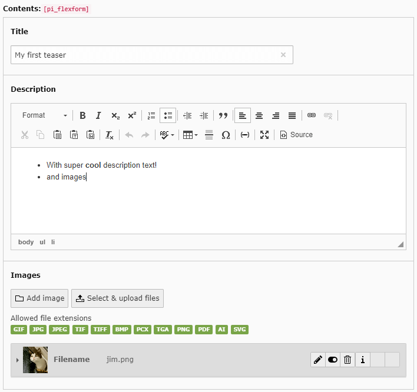

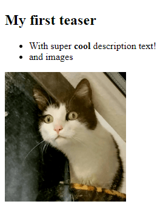

The Backend View
----------------

So far we have defined the fields of our content element and the frontend output.
But how is the content element displayed in the backend?

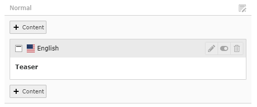

Well okay, it displays the title of the DCE we have defined. But we do not see any differences when we have two of these
content elements on the same page. Let's change this, by configuring the **Simple backend view**
in Backend Template tab.

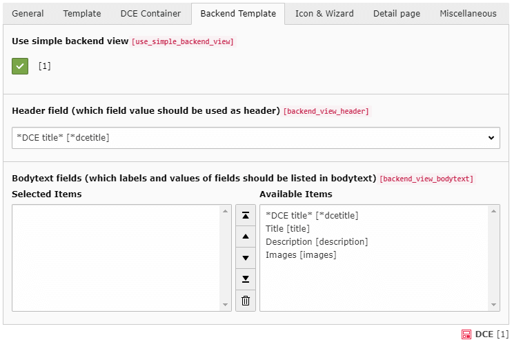

Here you can define which (single) field should be displayed as **header** (and label in list view). And which fields
should also get displayed in **bodytext**. When we choose all options from bodytext field (but DCE title), we get more
info about our content element instances:

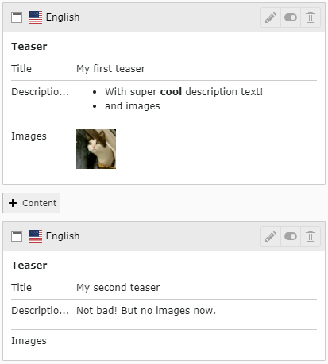

This saves much time and helps you to build fast new content elements.

.. hint::
   The size of the images displayed in Simple Backend View and the crop limit of long text is configurable via PageTS.

DCE Container
-------------

Until now, you know the very basics of how DCE works. Let's use a more intermediate feature as of the last step in this
tutorial, which is potentially helpful for you: **DCE Container**

First, let's see the output of our content elements in the HTML source code of frontend output.
We have placed two content elements on a page:

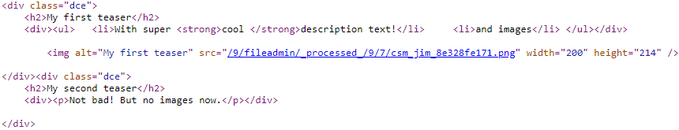

When we compare this HTML source with the Fluid template from above, we will see our code, with filled placeholders.
Each content element is wrapped with ``

``, because we have defined it in our template.

DCE Containers help you to wrap **all** those standalone elements with a custom **container template**.
First, you need to enable the feature:

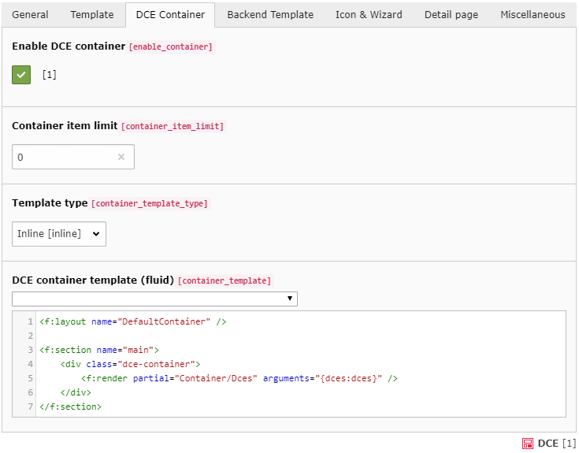

Just by enabling the feature (and clearing the caches) we see an instant effect in HTML output:

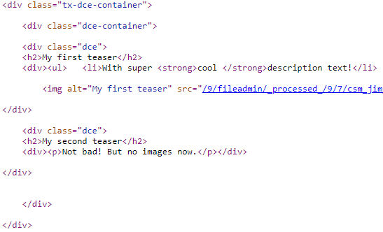

We see two wraps:

- ``dce-container`` This comes from the container template itself
- ``tx-dce-container`` This is because we use the *DefaultContainer* Fluid layout (which is optional)

Also, the backend view has been upgraded, it displays a color (calculated based on ``uid`` of the first element in the
container):

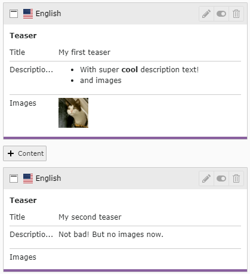

.. note::
   **DCE container is no replacement for EXT:gridelements!**
   Because the container is just generated by convention and logic, it has no physical instance which can have its own
   properties.

What's next?
------------

Congratulations! You know how to create a first content element in DCE.

Check out the next section in the documentation :ref:`Users manual <users-manual>` to get an overview of the options and possibilities
DCE gives you.

Have fun! And when you have questions, check out the :ref:`Support <support>` section :)
