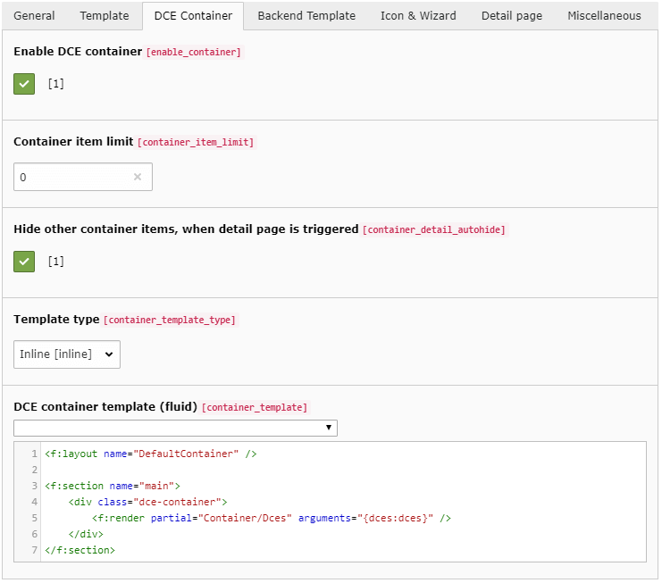
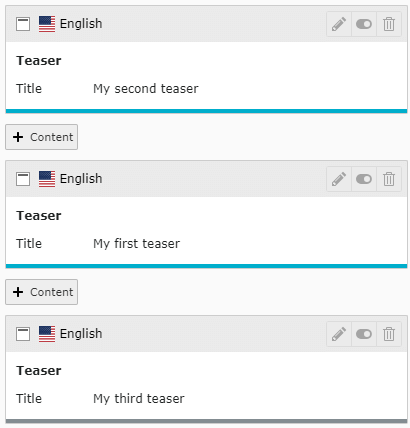
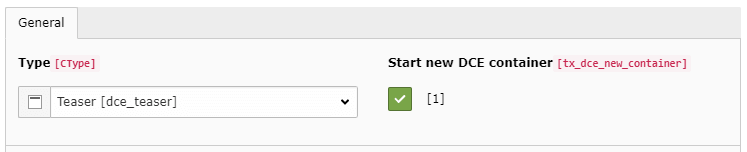

.. include:: ../Includes.txt

.. _users-manual-dcecontainer:

DCE Container
-------------

DCE Container is a new feature introduced in DCE 1.3. It allows you to wrap several content elements based on a
certain DCE with a Fluid template.

This is especially useful for slider libraries (for example). If you want to create one content element for one slide,
but you need to wrap all slides with a container ``
`` element, which initializes the functionality of the library.

First, you need to enable the feature:

Enable DCE Container
====================

Enables/Disables DCE Container feature. This option influences the frontend rendering instantly.

When enabled, all content elements (tt_content) in a row based on this DCE are wrapped with the DCE container template.
The content elements "in the row":

- base on the same DCE (with enabled DCE container feature)
- are located on the same ``pid``
- are located in the same ``sys_language_uid``
- are located in the same ``colPos``

Any other content element type interrupts the container.

.. caution::
   Shortcuts are supported, but when your Container starts with a CType:"shortcut" item, it will fail.

Container item limit
====================

You can set an item limit (default: 0 / disabled) to limit the number of content elements a container may have.
When the the limit is reached, the next content element starts a new container.

Hide other container items, when detail page is triggered
=========================================================

When the DCE container **and** the detail page feature is enabled, this option makes it more comfortable to hide
all other content elements, which' detail page template is not triggered.

When this checkbox is enabled, all items in a container are hidden, if one item in the container is triggered by
detail page GET parameter. In this case, the container template is still rendered, just with a single item.
Other containers are not affected.

Template type
=============

Like the default frontend template of DCE, you can outsource the code of the container to file.

DCE Container template
======================

This template contains the code of the container wrapped around all DCEs within the container.

.. code-block:: html

    

        <f:render partial="Container/Dces" arguments="{dces:dces}" />
    

All DCEs in the container are stored inside the variable ``{dces}`` which is an array of Dce model instances.

So when you iterate over the dces array (using ``f:for`` loop) you can access single field values or render the default
template. So this partial is basically this:

.. code-block:: html

    

        <f:for each="{dces}" as="dce">
            {dce.render -> f:format.raw()}
        </f:for>
    

Container iterator
~~~~~~~~~~~~~~~~~~

When DCE container is enabled, each DCE has the new attribute **containerIterator** available,
which allows you to get info about the position of the DCE inside of the container, like the iterator in Fluid
you know from ``f:for`` loop:

- ``{dce.containerIterator.total}``
- ``{dce.containerIterator.index}``
- ``{dce.containerIterator.cycle}``
- ``{dce.containerIterator.isEven}``
- ``{dce.containerIterator.isOdd}``
- ``{dce.containerIterator.isFirst}``
- ``{dce.containerIterator.isLast}``

Container in backend
~~~~~~~~~~~~~~~~~~~~

When you are using the Simple Backend View, you get a color mark for each content element:

The colors being used can be adjusted using PageTS (on root level):

.. code-block:: typoscript

    tx_dce.defaults.simpleBackendView.containerGroupColors {
            10 = #0079BF
            11 = #D29034
            12 = #519839
            13 = #B04632
            14 = #838C91
            15 = #CD5A91
            16 = #4BBF6B
            17 = #89609E
            18 = #00AECC
            19 = #ED2448
            20 = #FF8700
    }

By default, DCE provides ten color codes, which are picked based on the ``uid`` of the first content element in the
container.

Start new container
~~~~~~~~~~~~~~~~~~~

In content elements you also got a new option when DCE container is enabled:

When this checkbox is enabled, a new container is created, like in the screenshot above. With this, you can interrupt
containers manually.
