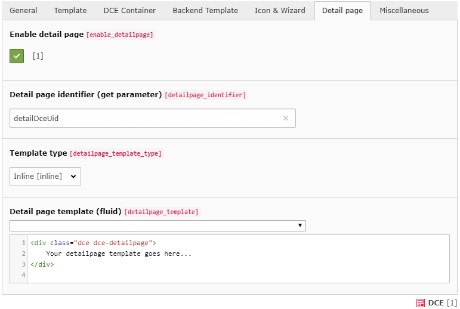

.. include:: ../Includes.txt

.. _users-manual-detailpage:

Detail page
-----------

The detail page can be used to display the fields of the DCE in another manner. For example, if you have many fields
defined for your DCE you can display the most important fields with the normal template
and the complete amount of fields with the detail template.

The decision to display either the normal template or the detail page template is done by detecting the
**detail page identifier** (GET parameter). If it is found and it contains the ``uid`` of the actually shown DCE, the
content is rendered with the detail page template otherwise the normal template is used.

.. important::
   When detail page template rendering is triggered, this has no effect on other content elements on the current page!

Enable detail page
^^^^^^^^^^^^^^^^^^

To enable the functionality for using a detail page you have to check this option.

Detail page identifier (get parameter)
^^^^^^^^^^^^^^^^^^^^^^^^^^^^^^^^^^^^^^

This is the parameter which must be used in the GET parameter of the URL to enable the display of the detail page.
The value of this GET parameter must be the ``uid`` of the displayed content object, to trigger the detail page template.

You should avoid using a parameter name, which is already in use, like "id", "type" or "L".

Template type
^^^^^^^^^^^^^

Like the *normal* template you can choose between the inline template code and using a template file.

Detail page template (fluid)
^^^^^^^^^^^^^^^^^^^^^^^^^^^^

Using the inline template type you have to insert the template code in the same manner as for the normal template.

How to create a link to detail template
~~~~~~~~~~~~~~~~~~~~~~~~~~~~~~~~~~~~~~~

In your "normal" template you probably want a link, to trigger the detail template for this content element.
Actually, it is pretty easy to create such a link in Fluid template:

.. code-block:: html

    <f:link.page additionalParams="{detailDceUid:contentObject.uid}">
        Show detail template of this content element
    </f:link.page>

Hide other content elements
~~~~~~~~~~~~~~~~~~~~~~~~~~~

.. tip::
   Since DCE 2.3, with enabled DCE container feature, you can automatically hide all other container items.
   Check out the option, "Hide other container items, when detail page is triggered" in DCE Container options.
   This checkbox is only available, when DCE container **and** detail page features are enabled.

If you have more DCEs with detail templates on one page, the template will just switch for one of your content elements.
The other DCE will still be visible and displays the normal template.

When you want to hide all other content elements you need to do some simple typoscript:

.. code-block:: typoscript

    [globalVar = GP:detailDceUid > 0]
        styles.content.get.select.uidInList {
            data = GP:detailDceUid
            intval = 1
        }
    [end]

This small snippet checks if the GET param "detailDceUid" is set. If it is set, it tells the select function in
CSS Styled content, to display just this one content element, by passing the GET parameter value to the query.

Of course, we need to avoid SQL injection, by casting the value to an integer by using (stdWrap.)intval.

This example removes all content element from normal column. If you want to remove all elements but the selected one in
another col, you just need to write eg. "styles.content.getLeft" or ".getRight" or ".getBorder".

**Caution:** This snippet will probably not work, because mostly TYPO3 Integrators uses this
to assign the contents to the template:

::

    page.10 < styles.content.get

The lower than sign (``<``) copies the given value. But with our snippet above we override the original one.
The copy will not be affected. The easiest way would be to use a reference instead:

::

    page.10 =< styles.content.get

Then you are able to change something in CSS Styled Content typoscript, which also affects the output.

Faking detail pages
^^^^^^^^^^^^^^^^^^^

To fake a separate page for each dce content element detail page - which is actually on the same page -
we can do some adjustments to RealUrl (when it is used) and overwrite the ``<title>`` tag in HTML.

RealURL example
~~~~~~~~~~~~~~~

Kudos to Dirk Wohlrabe who provided this realurl example:

.. code-block:: php

    <?php
    $TYPO3_CONF_VARS['EXTCONF']['realurl']['_DEFAULT'] = array(
        // ...
        'postVarSets' => array(
            '_DEFAULT' => array(
                'whatever' => array(
                    array(
                        'GETvar' => 'detailDceUid',
                        'lookUpTable' => array(
                            'table' => 'tt_content',
                            'id_field' => 'uid',
                            'alias_field' => 'header',
                            'addWhereClause' => ' AND NOT deleted',
                            'useUniqueCache' => 1,
                            'useUniqueCache_conf' => array(
                                'strtolower' => 1,
                                'spaceCharacter' => '-',
                            ),
                        ),
                    ),
                ),
            ),
        )
    );

Adjust <title> tag
~~~~~~~~~~~~~~~~~~
And here you will find an example how to put the header field to ``<title>`` tag in body:

.. code-block:: typoscript

    [globalVar = GP:detailDceUid > 0]
    config.noPageTitle = 1
    page {
        headerData {
            # I like using the current timestamp here to avoid
            # conflicts with extensions, which may add stuff to headerData
            1423042828 = CONTENT
            1423042828 {
                table = tt_content
                select {
                    uidInList.data = GP:detailDceUid
                    uidInList.intval = 1
                }
                renderObj = TEXT
                renderObj.field = header

                stdWrap.wrap = <title>|</title>
            }
        }
    }
    [end]

.. caution::
   All typoscript examples are based on TYPO3 8.7.
   In TYPO3 9.5 they cause deprecation log entries because it is not matching the Symfony Expression Language Syntax.

.. note::
   It is not possible to activate two content element detail pages at once.
