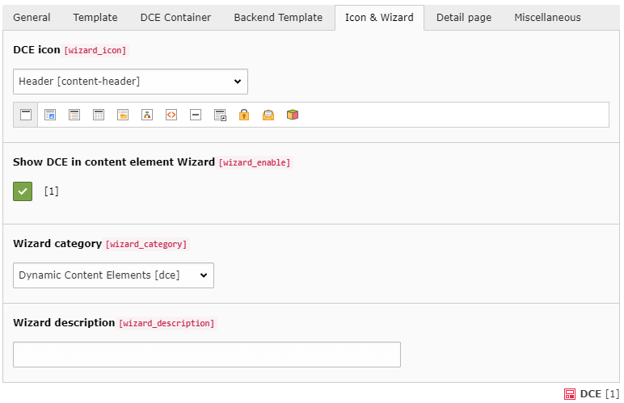

.. include:: ../Includes.txt

.. _users-manual-iconwizard:

Icon & Wizard
-------------

Here you can define an icon used for the new content element and control appearance in new content element wizard.

DCE icon
^^^^^^^^

The icon that is displayed in front of the entry in the wizard list can be chosen from a large number of available
icons. You can also choose "custom", which displays a new field to select the custom icon.

The icon also applies to CType icon.

Custom icon (24x24 pixel)
^^^^^^^^^^^^^^^^^^^^^^^^^

If none of the included icons fits your imagination you can also upload an icon in the format SVG, PNG or GIF
with 24x24 pixel.

Show DCE in content element Wizard
^^^^^^^^^^^^^^^^^^^^^^^^^^^^^^^^^^

When this option is enabled then an entry for this DCE is added to the list of the New Content Element Wizard.

Wizard category
^^^^^^^^^^^^^^^

You can select here in which category of the wizard the DCE should appear. Besides a new category
"Dynamic content elements" also the TYPO3 own categories are available.

Wizard description
^^^^^^^^^^^^^^^^^^

This is a short description text which is shown in the wizard and should describe what is the function of this
content element. It can be also be left empty.
