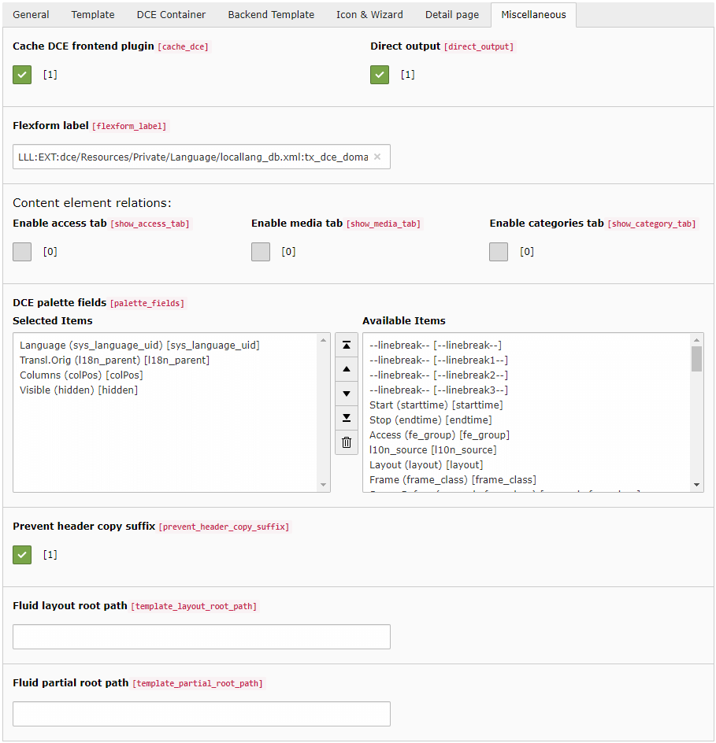
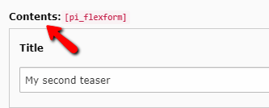

.. include:: ../Includes.txt

.. _users-manual-miscellaneous:

Miscellaneous
-------------

This tab contains all settings which are difficult to put in a category.

Cache DCE frontend plugin
^^^^^^^^^^^^^^^^^^^^^^^^^

This option activates or deactivates the caching of the DCE in the frontend. Every DCE that should be available in the
the frontend must be initialized in the localconf.php with calling the method ``ExtensionUtility::configurePlugin()``.

This option takes effect if the showAction of the DceController is cached or non-cached.

Direct output
^^^^^^^^^^^^^

With this option enabled you bypass ``css_styled_content`` or ``fluid_styled_content``.
Instead of using lib.contentElement, the DCE controller action is used directly.
This brings a significant performances boost and removes any wrappings defined by e.g. fluid_styled_content
(
).

**This option is enabled by default, separately for each DCE.**

FlexForm label
^^^^^^^^^^^^^^

Defines the text displayed in the content element:

Disables the "div.csc-default" wrapping
^^^^^^^^^^^^^^^^^^^^^^^^^^^^^^^^^^^^^^^

Only available, when ``EXT:css_styled_content`` is installed. This option disables the wrapping of the content element
with the ``
`` which can be sometimes necessary.

Enable access tab in backend
^^^^^^^^^^^^^^^^^^^^^^^^^^^^

If this option is activated a tab with the access rights is shown in the backend. Here you can define detailed,
when the DCE is to be shown and who is allowed to see the DCE. When this checkbox is enabled, the enabled fields
disappear from palette fields automatically, if set.

Enable media tab in backend
^^^^^^^^^^^^^^^^^^^^^^^^^^^

This option is only available when ``EXT:fluid_styled_content`` is installed. If this option is activated a tab with
media (FAL) field is shown in the backend.

You can access ``{contentObject.media}`` variable in Fluid template.
It contains an array of ``\TYPO3\CMS\Core\Resource\FileReference``.

Enable categories tab in backend
^^^^^^^^^^^^^^^^^^^^^^^^^^^^^^^^

If this option is activated a tab with category picker is shown in the backend.

You can access ``{contentObject.categories}`` variable in Fluid template.
It contains an array of ``\TYPO3\CMS\Extbase\Domain\Model\Category``.

DCE palette fields
^^^^^^^^^^^^^^^^^^

This is a list of fields which should be shown in the head area of this DCE in the backend.

The default value is this: ``sys_language_uid, l18n_parent, colPos, spaceBefore, spaceAfter, section_frame, hidden``

Prevent header copy suffix
^^^^^^^^^^^^^^^^^^^^^^^^^^

If this checkbox is checked (enabled by default) a copied tt_content record, based on this DCE, will not append
"Copy (1)" to record's header. It uses the header contents of the original content record.

Fluid layout and partial root path
^^^^^^^^^^^^^^^^^^^^^^^^^^^^^^^^^^

The two last fields define for all Fluid templates where to find the layouts and the partials.
Layouts and partials can be part of Fluid templates and are used to avoid redundancies and keep the code cleaner.
