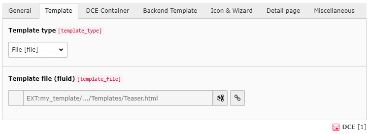
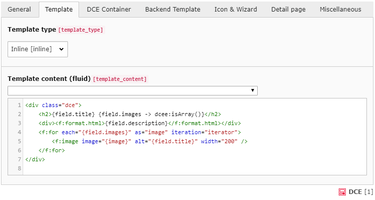
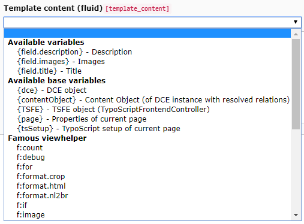

.. include:: ../Includes.txt

.. _users-manual-template:

Template
--------

On this tab, you define the template which is used for displaying the content of the DCE in the FE.
You can use the full power of Fluid at this place.

Template type
^^^^^^^^^^^^^

.. tip::
   There are several templates a DCE can have. These options apply to all of them.

File
++++

The option **File** let you choose a file that contains the Fluid content that should be used as the template for
this DCE. The file name is selected in the "Template file (fluid)" input field.

This option makes it possible that you put the templates under revision control due to the fact that the files are
stored in the file system.

The **EXT:** syntax is supported and encouraged to use, to point to template files provided by a template extension.

Inline
++++++

The default template type **Inline** let you directly edit the content of the Fluid template inside the code mirror editor
of the "Template content (fluid)" entry field.

No namespace declaration
^^^^^^^^^^^^^^^^^^^^^^^^

Since DCE 2.0 you do not need to provide the namespace declaration in each template. "dce:" is registered globally as
available namespace in Fluid templates.

So this is deprecated:

::

    {namespace dce=ArminVieweg\Dce\ViewHelpers}
    

        Your template goes here...
    </dce>

Just skip the namespace line. But it is not problematic when this line is still left in the template.

Dynamic Templating
^^^^^^^^^^^^^^^^^^

With the select box in the "Template content (fluid)" section you can insert variables and view helpers into the
template. The selected variable or view helper is inserted at the current cursor position in the template.

There are several groups inside the select box, which offers you help to work with Fluid:

- Available variables
- Available base variables
- Famous view helpers
- DCE view helpers

Available variables
+++++++++++++++++++

This group shows all previously defined variables. You have to save the DCE before newly created fields appear in the
 dropdown field. All custom variables are available with:

::

    {field.nameOfVariable}

Available base variables
++++++++++++++++++++++++

Besides the custom created variables, they are also some variables existing which are available in all DCEs:

+ ``{dce}`` - The DCE object. To access field values use: ``{dce.get.fieldName}``
+ ``{contentObject}`` - The content object row, this DCE instance is based on. It contains all tt_content properties.
+ ``{TSFE}`` - The TypoScript frontend controller
+ ``{page}`` - Properties of the current page
+ ``{tsSetup}`` - TypoScript setup of the current page

Famous view helper
++++++++++++++++++

This group lists often used view helpers provided by Fluid itself.
Detailed information about the Fluid view helper you will find in the official `TYPO3 documentation <http://docs.typo3.org/flow/TYPO3FlowDocumentation/stable/TheDefinitiveGuide/PartV/FluidViewHelperReference.html>`_

* f:count
* f:debug
* f:for
* f:format.crop
* f:format.html
* f:if
* f:image
* f:link.email
* f:link.external
* f:link.page
* f:render

DCE view helpers
++++++++++++++++

DCE also provides own view helpers, which can help using the field data in Fluid.

.. tip::
   When you select a DCE view helper from the dropdown above inline code editor,
   you will get an example pasted to the current cursor position.

dce:arrayGetIndex
~~~~~~~~~~~~~~~~~

Normally you can access array values with ``{array.0}``, ``{array.1}``, etc. if they have numeric keys. This view helper
converts named keys to numeric ones. Furthermore if you are able to set the index dynamically (i.e. from variable).
Index default is ``0``.

Example:

::

    {array -> dce:arrayGetIndex(index:'{iteration.index}')}

dce:GP
~~~~~~

Gets ``$_GET`` or ``$_POST`` variables from current request.

Example:

::

    {dce:GP(subject:'myCoolGetParameter')}

.. caution::
   Never use this view helper for direct output!! This would provoke XSS (Cross-site scripting).

dce:explode
~~~~~~~~~~~

Performs ``trimExplode`` (of ``GeneralUtility``) to given string and returns an array.
Available options are: *delimiter* (default: ``,``) and *removeEmpty* (``1``).

Example:

::

    {string -> dce:explode(delimiter:'\n')}

dce:fal
~~~~~~~

Get file references in FAL. The option contentObject **must** pass the contentObject to the view helper,
the option field must contain the variable name of the field which contains the media.

Example:

::

    <f:for each="{dce:fal(field:'thisVariableName', contentObject:contentObject)}" as="fileReference">
        <f:image src="{fileReference.uid}" alt="" treatIdAsReference="1" />
    </f:for>

.. note::
   You do not need to use the FAL view helper anymore, to access your images.
   With ``<dce_load_schema>1</dce_load_schema>`` in your FAL field configuration, the FAL references get
   resolved automatically.

dce:fileInfoViewHelper
~~~~~~~~~~~~~~~~~~~~~~

Useful to fetch informations about a single ``sys_file`` record, you need to deal with when using section fields.
Most common attributes are: title, description, alternative, width, height, name, extension, size and uid.

Example (when working with sections):

::

    <f:for each="{field.section}" as="entry">
        <f:for each="{entry.images -> dce:explode()}" as="imageUid">
            <f:image src="file:{imageUid}" width="350" /> 
            Width: <dce:fileInfo fileUid="{imageUid}" attribute="width" />px
        </f:for>
    </f:for>

dce:format.addcslashes
~~~~~~~~~~~~~~~~~~~~~~

Add slashes to a given string using the PHP function "addcslashes".
Available option is: *charlist* (default: ``','``).

Example:

::

    <dce:format.addcslashes>{field.myVariable}</dce:format.addcslashes>

::

    {field.myVariable -> dce:format.addcslashes()}

dce:format.cdata
~~~~~~~~~~~~~~~~

Wraps given *subject* with CDATA. Good for fluid templates which render XML.

Example:

::

    <dce:format.cdata>{field.xml}</dce:format.cdata>

::

    {field.xml -> dce:format.cdata()}

dce:format.replace
~~~~~~~~~~~~~~~~~~

Performs `str_replace` on given *subject*.

Example:

::

    {field.text -> dce:format.replace(search: 'foo', replace: 'bar')}

dce:format.stripslashes
~~~~~~~~~~~~~~~~~~~~~~~

Strips slashes from given *subject*. The option *performTrim*  (default: ``1``) does also perform a trim when enabled.

Example:

::

    {field.text -> dce:format.stripslashes(performTrim: 0)}

dce:format.strtolower
~~~~~~~~~~~~~~~~~~~~~

Performs `strtolower` on given *subject* and converts string to lower case.

Example:

::

    {field.text -> dce:format.strtolower()}

dce:format.tiny
~~~~~~~~~~~~~~~

Removes tabs and line breaks.

Example:

::

    <dce:format.tiny>
        Removes tabs and
        linebreaks.
    </dce:format.tiny>

dce:format.ucfirst
~~~~~~~~~~~~~~~~~~

Convert a string's first character to uppercase.

Example:

::

    {variable -> dce:format.ucfirst()}

dce:format.wrapWithCurlyBraces
~~~~~~~~~~~~~~~~~~~~~~~~~~~~~~

Use this view helper if you want to wrap something with curly braces {}. Available options are: *prepend* and *append*,
which add strings before or after the given variable, but inside of curly braces.

Example:

::

    <dce:format.wrapWithCurlyBraces prepend="" append="">{field.myVariable}</dce:format.wrapWithCurlyBraces>

dce:isArray
~~~~~~~~~~~

Checks if given value is an array. Example:

::

    {variable -> dce:isArray()}

dce:thisUrl
~~~~~~~~~~~

Returns url of current page. Available options are: *showHost* (Default: ``1``), *showRequestedUri* (Default: ``1``)
and *urlencode* *showRequestedUri* (Default: ``0``).

Example:

::

    {dce:thisUrl(showHost:1, showRequestedUri:1, urlencode:0)}
