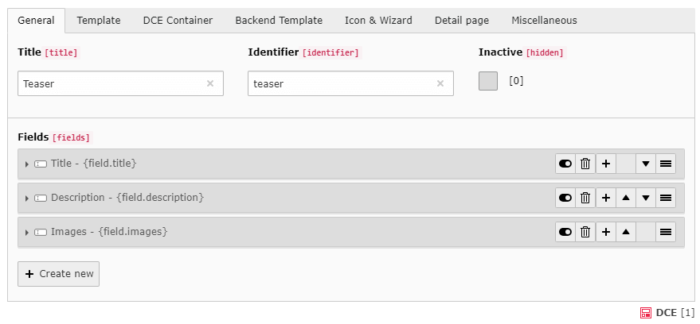
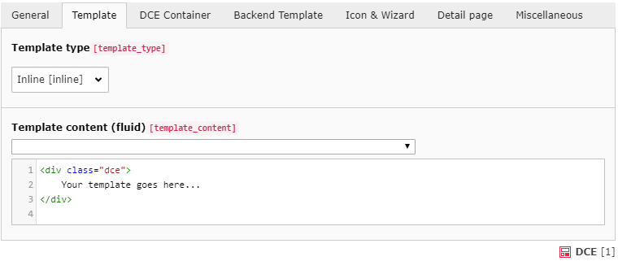

# DCE-Extension for TYPO3

## What is DCE?

DCE is an extension for TYPO3 CMS, which creates easily and fast *dynamic content elements*.
Based on Extbase, Fluid and over 8 years of experience.


### Screenshots






## Installation

You can install DCE in TYPO3 CMS using the [TER](https://extensions.typo3.org/extension/dce/) 
or use composer to fetch DCE from [packagist](https://packagist.org/packages/t3/dce):

```
composer req t3/dce:"^2.3"
```


## Documentation

The full documentation can be found here: https://docs.typo3.org/p/t3/dce/master/en-us/


## How to contribute?

Just fork this repository and create a pull request to the **master** branch.
Please also describe why you've submitted your patch. If you have any questions feel free to contact me.

In case you can't provide code but want to support DCE anyway, here is my [PayPal donation link](https://www.paypal.com/cgi-bin/webscr?cmd=_s-xclick&hosted_button_id=2DCCULSKFRZFU).

**Thanks to all contributors and sponsors!**


### Dev Environment

The DCE repository ships a complete Vagrantfile, which allows you to create a
virtual machine with a full LAMP stack and automation scripts to install and configure TYPO3
in version 8 and 9. Just Open Source tools and code are in use. 

Get more infos here: [TYPO3 Extension Box](https://bit.ly/t3-extension-box)


#### How to use

You just need to install:

- [Virtual Box (5.x)](https://www.virtualbox.org/wiki/Download_Old_Builds_5_2)
- [Vagrant](https://www.vagrantup.com/downloads.html)

and perform these steps on command line (CLI):

1. First we need to install a few vagrant plugins:
   - ``$ vagrant plugin install vagrant-bindfs``
   - ``$ vagrant plugin install vagrant-hostmanager``
   - ``$ vagrant plugin install vagrant-winnfsd`` (just required when you use Windows)
2. Then we clone the DCE source code and switch in the dce directory:
   - ``$ git clone https://bitbucket.org/ArminVieweg/dce.git``
   - ``$ cd dce``
3. Now, we just need to perform one last command: ``vagrant up``
4. After a few minutes the set up is complete and **you can instantly use DCE** in TYPO3 8 LTS or 9 LTS
   - http://dce.local (Overview & Tools)
   - http://dce.local/8/typo3
   - http://dce.local/9/typo3
