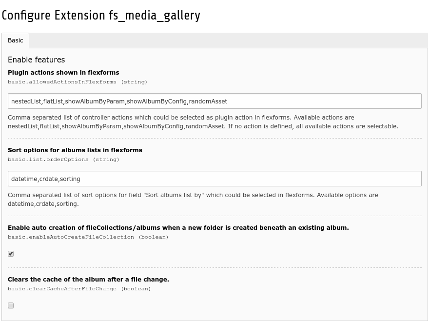

.. ==================================================
.. FOR YOUR INFORMATION
.. --------------------------------------------------
.. -*- coding: utf-8 -*- with BOM.

.. include:: ../../Includes.txt

.. _configuration-extConf:

Extension Manager
=================

Target group: **Developers**

EXT:fs_media_gallery offers some basic configuration inside the Extension Manager.
To set this configuration, switch to the Extension Manager, search for the extension
*fs_media_gallery* and click on it to open the configuration view.

.. container:: ts-properties

   ================================================================================================= ================================ ===================================================================
   Property                                                                                          Data type                        Default
   ================================================================================================= ================================ ===================================================================
   :ref:`allowedActionsInFlexforms <extConf.tx_fsmedia_gallery.allowedActionsInFlexforms>`           :ref:`t3tsref:data-type-list`    nestedList,flatList,showAlbumByParam,showAlbumByConfig,randomAsset
   :ref:`list.orderOptions <extConf.tx_fsmedia_gallery.list.orderOptions>`                           :ref:`t3tsref:data-type-list`    datetime,crdate,sorting
   :ref:`enableAutoCreateFileCollection <extConf.tx_fsmedia_gallery.enableAutoCreateFileCollection>` :ref:`t3tsref:data-type-boolean` true
   :ref:`clearCacheAfterFileChange <extConf.tx_fsmedia_gallery.clearCacheAfterFileChange>`           :ref:`t3tsref:data-type-boolean` false
   ================================================================================================= ================================ ===================================================================

Property details
^^^^^^^^^^^^^^^^

.. _extConf.tx_fsmedia_gallery.allowedActionsInFlexforms:

allowedActionsInFlexforms
"""""""""""""""""""""""""

Defines plugin actions shown in flexforms so you can disable unwanted plugin modes.
Comma separated list of controller actions which could be selected as
":ref:`Display mode <flexforms.mediagallery.tabs.general.displayMode>`" in flexforms.
Available actions are:

* nestedList
* flatList
* showAlbumByParam
* showAlbumByConfig
* randomAsset

If no action is defined, *all* available actions are selectable.

.. _extConf.tx_fsmedia_gallery.list.orderOptions:

list.orderOptions
"""""""""""""""""

Comma separated list of sort options for field ":ref:`Sort albums list by <flexforms.mediagallery.tabs.general.list.orderBy>`" in flexforms.
Available actions are:

* datetime
* crdate
* sorting

.. _extConf.tx_fsmedia_gallery.enableAutoCreateFileCollection:

enableAutoCreateFileCollection
""""""""""""""""""""""""""""""

Enables auto creation of fileCollection(s)/album(s) of a folder when a new folder is created beneath an existing fileCollection/album.

.. _extConf.tx_fsmedia_gallery.clearCacheAfterFileChange:

clearCacheAfterFileChange
"""""""""""""""""""""""""

Clears the cache of the album after a file change. Set on false by default due that the cache will be cleared multiple times
if more files will be added. Make sure "`TCEMAIN.clearCacheCmd`" is set as this value is used to define what cache should be cleared.

For more info about possible values see  `Docs » Page TSconfig » ->TCEMAIN <https://docs.typo3.org/typo3cms/TSconfigReference/PageTsconfig/TCEmain/Index.html#clearcachecmd>`_.

       **Image 1:** General extensionmanager settings
