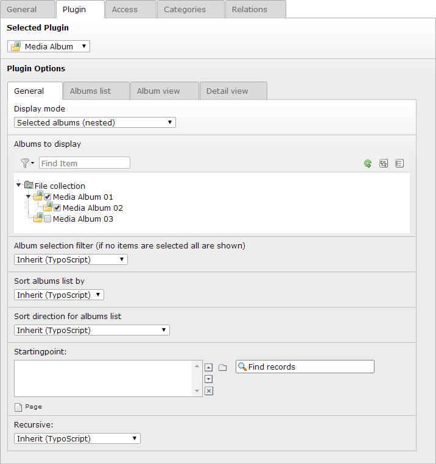
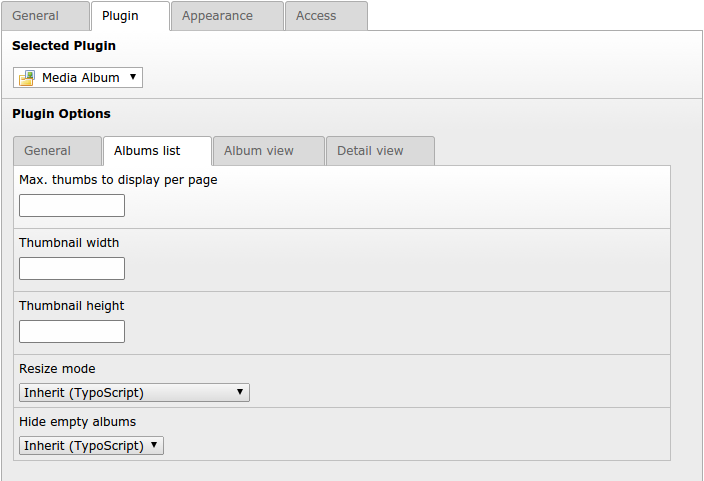
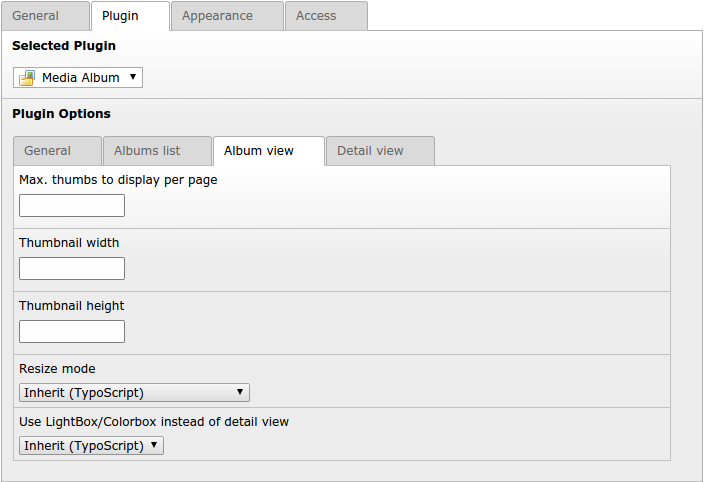
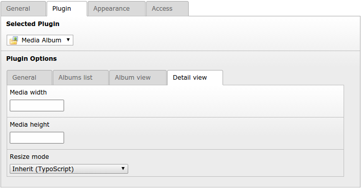
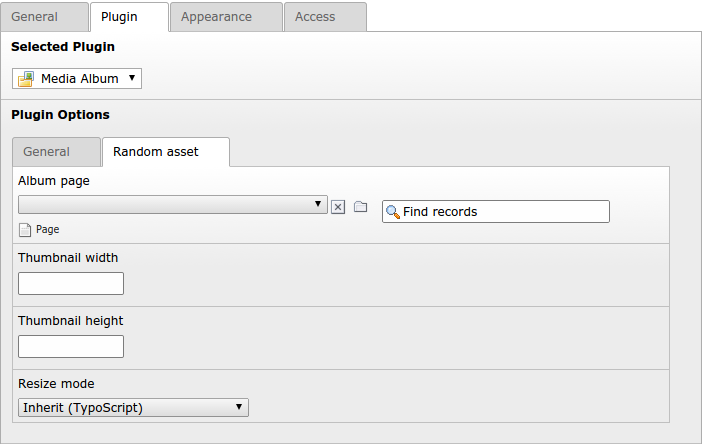

.. ==================================================
.. FOR YOUR INFORMATION
.. --------------------------------------------------
.. -*- coding: utf-8 -*- with BOM.

.. include:: ../../Includes.txt

.. _configuration-plugin:

Plugin Configuration
====================

Target group: **Editors**, **Developers**

Most configuration settings can be set through the flexform settings.
As not every configuration is needed for every view, the not needed are hidden.
Every setting can also be set by using :ref:`TypoScript <configuration-typoscript>`.

.. important::

   The settings of the plugin always override the ones from TypoScript.

.. todo: add docu for plugin configuration and screenshots

.. contents::
   :local:
   :depth: 1

.. _flexforms.mediagallery.tabs.general:

Tab "General"
-------------

   **Image 1:** Tab "General" of plugin in display mode "Selected albums (nested)"

=================== ================= ================================================================================================== ===================
Field               Display Modes     Description                                                                                        TSref
=================== ================= ================================================================================================== ===================
Display mode all                      .. _flexforms.mediagallery.tabs.general.displayMode:                                               none

                                      Sets the display mode of the Plugin.

                                      * Selected albums (nested) = ``nestedList``
                                      * Albums list (flattened) = ``flatList``
                                      * Single album (URL handover enabled) = ``showAlbumByParam``
                                      * Single album (URL handover disabled) = ``showAlbumByConfig``
                                      * Random media asset = ``randomAsset``

                                      You enable/disable these items via the plugin configuration in the
                                      :ref:`Extension Manager <configuration-extConf>`
Media Albums        nestedList,       .. _flexforms.mediagallery.tabs.general.mediaAlbums:                                               :ref:`settings.mediaAlbumsUids <plugin.tx_fsmediagallery.settings.mediaAlbumsUids>`
                    randomAsset
                                      Album selection for ``nestedList`` and ``randomAsset`` views.

                                      .. important::

                                         If you want to display a nested album you have to select all of its parent albums.
Album selection     nestedList,       .. _flexforms.mediagallery.tabs.general.useAlbumFilterAsExclude:                                   :ref:`settings.useAlbumFilterAsExclude <plugin.tx_fsmediagallery.settings.useAlbumFilterAsExclude>`
filter              randomAsset
                                      Include or exclude selected album items
Sort albums list by nestedList,       .. _flexforms.mediagallery.tabs.general.list.orderBy:                                              :ref:`settings.list.orderBy <plugin.tx_fsmediagallery.settings.list.orderBy>`
                    flatList
                                      Defines how albums in list views are ordered.
Sort direction      nestedList,       .. _flexforms.mediagallery.tabs.general.list.orderDirection:                                       :ref:`settings.list.orderDirection <plugin.tx_fsmediagallery.settings.list.orderDirection>`
for albums list     flatList
                                      Defines the sort direction (ascending/descending) for albums list in list views.
Startingpoint       all               .. _flexforms.mediagallery.tabs.general.startingpoint:                                             :ref:`presistence.storagePid <plugin.tx_fsmediagallery.persistence.storagePid>`

                                      The "Storage Folder" which holds the album records.
Recursive           all               .. _flexforms.mediagallery.tabs.general.recursive:                                                 :ref:`presistence.recursive <plugin.tx_fsmediagallery.persistence.recursive>`

                                      Recursion level of the :ref:`Startingpoint <flexforms.mediagallery.tabs.general.startingpoint>`.

=================== ================= ================================================================================================== ===================

.. _flexforms.mediagallery.tabs.list:

Tab "Albums list"
-----------------

   **Image 2:** Tab "Album list" of plugin"

================================== ====================== ================================================================================================== ===================
Field                              Display Modes          Description                                                                                        TSref
================================== ====================== ================================================================================================== ===================
Max. thumbs to display per page    nestedList, flatList   .. _flexforms.mediagallery.tabs.list.itemsPerPage:                                                 :ref:`settings.list.pagination.itemsPerPage <plugin.tx_fsmediagallery.settings.list.pagination.itemsPerPage>`

                                                          Define how many items are shown on one page.
Thumb width                        nestedList, flatList   .. _flexforms.mediagallery.tabs.list.thumb.width:                                                  :ref:`settings.list.thumb.width <plugin.tx_fsmediagallery.settings.list.thumb.width>`

                                                          Height of thumbnail images.
Thumb height                       nestedList, flatList   .. _flexforms.mediagallery.tabs.list.thumb.height:                                                 :ref:`settings.list.thumb.height <plugin.tx_fsmediagallery.settings.list.thumb.height>`

                                                          Width of thumbnail images.
Random thumbnail                   nestedList, flatList   .. _flexforms.mediagallery.tabs.list.thumb.random:                                                 :ref:`settings.list.thumb.resizeMode <plugin.tx_fsmediagallery.settings.list.thumb.random>`

                                                          Defines if a random thumbnail or the first found should be used.
Resize mode                        nestedList, flatList   .. _flexforms.mediagallery.tabs.list.thumb.resizeMode:                                             :ref:`settings.list.thumb.resizeMode <plugin.tx_fsmediagallery.settings.list.thumb.resizeMode>`

                                                          Defines how thumbnails in list view are scaled.
Hide empty albums                  nestedList, flatList   .. _flexforms.mediagallery.tabs.list.hideEmptyAlbums:                                              :ref:`settings.list.hideEmptyAlbums <plugin.tx_fsmediagallery.settings.list.hideEmptyAlbums>`

                                                          Option to exclude albums without media assets from list views.
================================== ====================== ================================================================================================== ===================

.. _flexforms.mediagallery.tabs.album:

Tab "Album view"
----------------

   **Image 3:** Tab "Album view" of plugin"

================================== ====================== ================================================================================================== ===================
Field                              Display Modes          Description                                                                                        TSref
================================== ====================== ================================================================================================== ===================
Sort media/files by                nestedList, flatList,  .. _flexforms.mediagallery.tabs.album.assets.orderBy:                                              :ref:`settings.album.assets.orderBy <plugin.tx_fsmediagallery.settings.album.assets.orderBy>`
                                   showAlbumByParam,
                                   showAlbumByConfig      Defines the sorting of the media/fiels shown in a album.
Sort direction for media/files     nestedList, flatList,  .. _flexforms.mediagallery.tabs.album.assets.orderDirection:                                       :ref:`settings.album.assets.orderDirection <plugin.tx_fsmediagallery.settings.album.assets.orderDirection>`
                                   showAlbumByParam,
                                   showAlbumByConfig      Defines the sort direction (ascending/descending) of the media/files.
Max. thumbs to display per page    nestedList, flatList,  .. _flexforms.mediagallery.tabs.album.itemsPerPage:                                                :ref:`settings.album.pagination.itemsPerPage <plugin.tx_fsmediagallery.settings.album.pagination.itemsPerPage>`
                                   showAlbumByParam,
                                   showAlbumByConfig      Defines how many items are shown on one album page.
Thumb width                        nestedList, flatList,  .. _flexforms.mediagallery.tabs.album.thumb.width:                                                 :ref:`settings.album.thumb.width <plugin.tx_fsmediagallery.settings.album.thumb.width>`
                                   showAlbumByParam,
                                   showAlbumByConfig      Height of thumbnail images in album view.
Thumb height                       nestedList, flatList,  .. _flexforms.mediagallery.tabs.album.thumb.height:                                                :ref:`settings.album.thumb.height <plugin.tx_fsmediagallery.settings.album.thumb.height>`
                                   showAlbumByParam,
                                   showAlbumByConfig      Width of thumbnail images in album view.
Resize mode                        nestedList, flatList,  .. _flexforms.mediagallery.tabs.album.thumb.resizeMode:                                            :ref:`settings.album.thumb.resizeMode <plugin.tx_fsmediagallery.settings.album.thumb.resizeMode>`
                                   showAlbumByParam,
                                   showAlbumByConfig      Defines how thumbnails in album view are scaled.
Use LightBox/Colorbox instead      nestedList, flatList,  .. _flexforms.mediagallery.tabs.album.lightbox.enable:                                             :ref:`settings.album.lightbox.enable <plugin.tx_fsmediagallery.settings.album.lightbox.enable>`
of detail view                     showAlbumByParam,
                                   showAlbumByConfig      Option to do not link to detail view from album list but display media assets using a
                                                          lightbox/colorbox.
Display title                      nestedList, flatList,  .. _flexforms.mediagallery.tabs.album.displayTitle:                                                :ref:`settings.album.displayTitle <plugin.tx_fsmediagallery.settings.album.displayTitle>`
                                   showAlbumByParam,
                                   showAlbumByConfig      Option to hide albums title.
================================== ====================== ================================================================================================== ===================

.. _flexforms.mediagallery.tabs.detail:

Tab "Detail view"
-----------------

   **Image 4:** Tab "Detail view" of plugin"

================================== ====================== ================================================================================================== ===================
Field                              Display Modes          Description                                                                                        TSref
================================== ====================== ================================================================================================== ===================
Media width                        nestedList, flatList,  .. _flexforms.mediagallery.tabs.detail.asset.width:                                                :ref:`settings.detail.asset.width <plugin.tx_fsmediagallery.settings.detail.asset.width>`
                                   showAlbumByParam,
                                   showAlbumByConfig      Height of media asset in detail view.

Media height                       nestedList, flatList,  .. _flexforms.mediagallery.tabs.detail.asset.height:                                               :ref:`settings.detail.asset.height <plugin.tx_fsmediagallery.settings.detail.asset.height>`
                                   showAlbumByParam,
                                   showAlbumByConfig      Width of media asset in detail view.

Resize mode                        nestedList, flatList,  .. _flexforms.mediagallery.tabs.detail.asset.resizeMode:                                           :ref:`settings.detail.asset.resizeMode <plugin.tx_fsmediagallery.settings.detail.asset.resizeMode>`
                                   showAlbumByParam,
                                   showAlbumByConfig      Defines how media assets in detail view are scaled.
================================== ====================== ================================================================================================== ===================

.. _flexforms.mediagallery.tabs.random:

Tab "Random asset"
------------------

   **Image 5:** Tab "Random view" of plugin"

================================== ====================== ================================================================================================== ===================
Field                              Display Modes          Description                                                                                        TSref
================================== ====================== ================================================================================================== ===================
Album page                         randomAsset            .. _flexforms.mediagallery.tabs.random.targetPid:                                                  :ref:`settings.random.targetPid <plugin.tx_fsmediagallery.settings.random.targetPid>`

                                                          Target page a random assets should link to. Select a page on which a plugin is configured to
                                                          display the full album (:ref:`Display Mode <flexforms.mediagallery.tabs.general.displayMode>` =
                                                          ``showAlbumByParam``, ``nestedList`` or ``flatList``).

Thumbnail width                    randomAsset            .. _flexforms.mediagallery.tabs.random.thumb.width:                                                :ref:`settings.random.thumb.width <plugin.tx_fsmediagallery.settings.random.thumb.width>`

                                                          Height of thumbnail images of random media assets.

Thumbnail height                   randomAsset            .. _flexforms.mediagallery.tabs.random.thumb.height:                                               :ref:`settings.random.thumb.height <plugin.tx_fsmediagallery.settings.random.thumb.height>`

                                                          Width of thumbnail images of random media assets.

Resize mode                        randomAsset            .. _flexforms.mediagallery.tabs.random.thumb.resizeMode:                                           :ref:`settings.random.thumb.resizeMode <plugin.tx_fsmediagallery.settings.random.thumb.resizeMode>`

                                                          Defines how thumbnails of random media assets are scaled.

================================== ====================== ================================================================================================== ===================

.. _flexforms.mediagallery.hide.field:

Hide flexform fields for editors
--------------------------------

Through some UserTs and/or PageTs settings you are able to hide flexform fields for editors. ::

	TCEFORM.tt_content.pi_flexform.fsmediagallery_mediagallery.general.settings\.useAlbumFilterAsExclude.disabled = 1
	TCEFORM.tt_content.pi_flexform.fsmediagallery_mediagallery.general.settings\.list\.orderBy.disabled = 1
	TCEFORM.tt_content.pi_flexform.fsmediagallery_mediagallery.general.settings\.list\.orderDirection.disabled = 1
