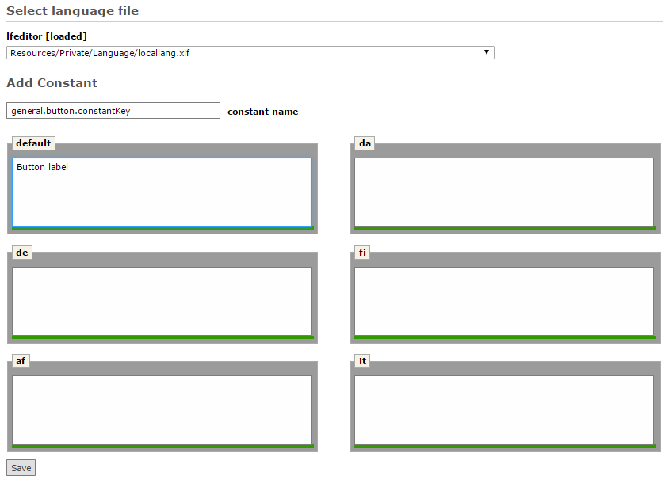

.. ==================================================
.. FOR YOUR INFORMATION
.. --------------------------------------------------
.. -*- coding: utf-8 -*- with BOM.

Add Constant
------------

This option serves for adding new constants to language files.
The user needs to enter a new name and translations for chosen languages can also be entered right away.

