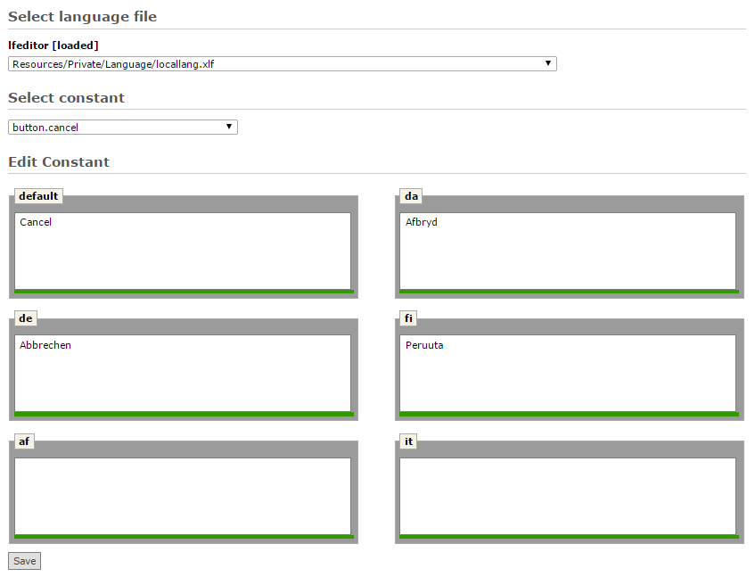

.. ==================================================
.. FOR YOUR INFORMATION
.. --------------------------------------------------
.. -*- coding: utf-8 -*- with BOM.

.. _edit-constant-reference:

Edit Constant
-------------

This option serves for translating a single constant in several languages.
Available languages depend of user language privileges and of the configured "view languages".

