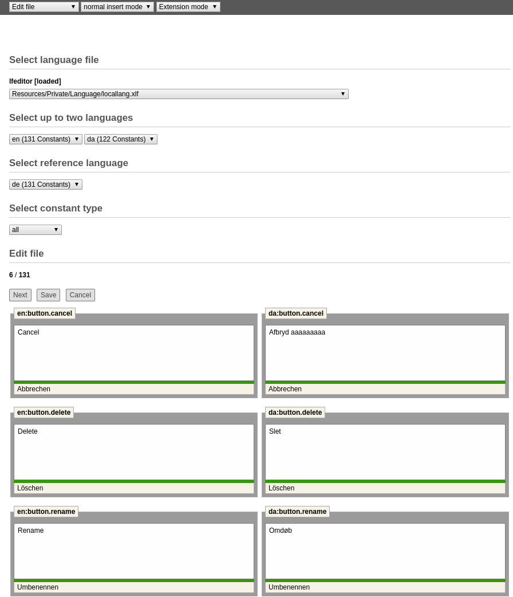

.. ==================================================
.. FOR YOUR INFORMATION
.. --------------------------------------------------
.. -*- coding: utf-8 -*- with BOM.

.. _edit-file-reference:

Edit File
---------

This option allows editing of all constants in a language file and a selected language.
Users can choose between translated, untranslated, unknown or all constants.
This whole dialog is handled by a session. This means that a user can translate a whole page and doesn't need to
save the changes before clicking on 'next' button to get the next page with language constants.
If the translation process is finished or user just wants to make a break, the changes should be saved.

Parallel editing is nice feature which allows editing two languages at the same time.
It is triggered by selecting languages in both language selection lists in section "Select up to two languages".
Section "Select reference language" allows user to chose which language will be used as reference for translating.
Reference language translations are shown beneath each text box.

