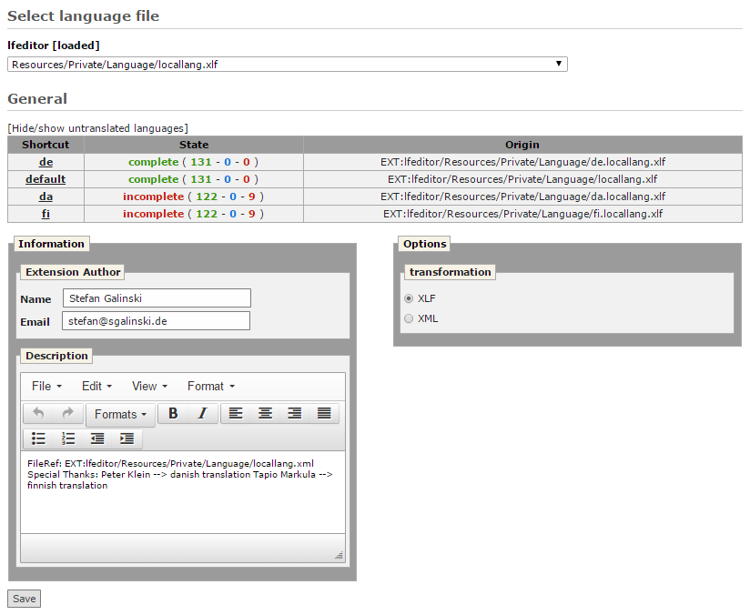

.. ==================================================
.. FOR YOUR INFORMATION
.. --------------------------------------------------
.. -*- coding: utf-8 -*- with BOM.

.. _general-reference:

General
-------

This option displays general information about several languages.
Displayed languages should be configured in the configuration section of LFEditor,
because default behavior of LFEditor for administrators is to displays all existing translation languages of TYPO3.
While non-admin users see only languages which they have permissions for.

Beside the language shortcut, there is state and origin of the related language file.
Clicking any language shortcut redirects to :ref:`Edit File <edit-file-reference>` page for this language.
Column ‘state‘ shows the state of translation and contains number of translated, unknown and untranslated language constants.
Unknown constants are the ones which exist in the language, and don’t exist in default language.

At the bottom of this page there are options for converting and splitting language files.
Those options are not displayed in override mode and it is not possible to merge XLF files.
Splitting of language files increases the performance of backend and frontend.
There is also a field set which allows editing of meta information of language files.

