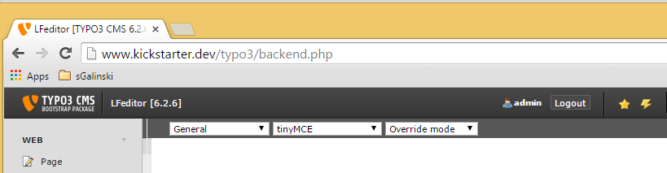

.. ==================================================
.. FOR YOUR INFORMATION
.. --------------------------------------------------
.. -*- coding: utf-8 -*- with BOM.

Main Menu Options
-----------------

Main navigation through LFEditor is done by selecting one of the options of drop down menu (main menu)
on top-left part of the screen (frame).
Main menu options are described in following sections of this chapter.

Page of each main menu option (except backup option) contains selection list of all available language files in typo3 CMS,
sorted by belonging extension. First time opening the extension might take few seconds to find all the language files,
but after that, the file list is cached and loading goes fast.
If language files are added or removed (not by LFEditor) from TYPO3 CMS, user should flush general caches,
to force LFEditor to read new list of language files.

After each "Save" operation, LFEditor will automatically clear language cache, so the changes can be visible immediately
when user opens the page which uses changed language file.

.. toctree::
	:maxdepth: 2
	:titlesonly:
	:glob:

	General/Index
	EditFile/Index
	EditConstant/Index
	AddConstant/Index
	DeleteConstant/Index
	RenameConstant/Index
	SearchConstant/Index
	ViewTree/Index
	ManageBackups/Index
