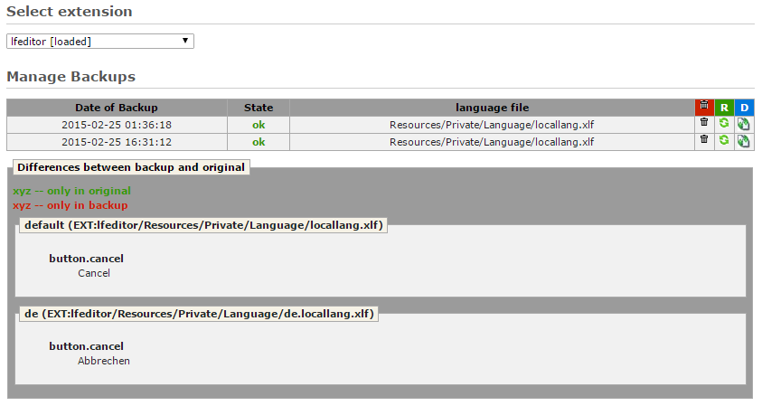

.. ==================================================
.. FOR YOUR INFORMATION
.. --------------------------------------------------
.. -*- coding: utf-8 -*- with BOM.

Manage Backups
--------------

The backup option displays all backups of the selected extension.
It is possible to recover every backup, delete them or just have a look at the differences.
User can revert splitting and merging of files too. Conversions of the file format are not revertible.
If language file was converted to other format, there will be red warning in status of the backup table entry
and that backup can only be deleted.

All changes since the backup are visible trough 'differences' functionality.
Green color means that the constant was added and red that it was deleted since the backup was made.
Example at the bottom of this section shows that user have made changes in value of 'button.cancel' constant,
and old value of the constant is shown. If restore is executed, that old value will replace current value
(which is not visible in difference view of backup).

