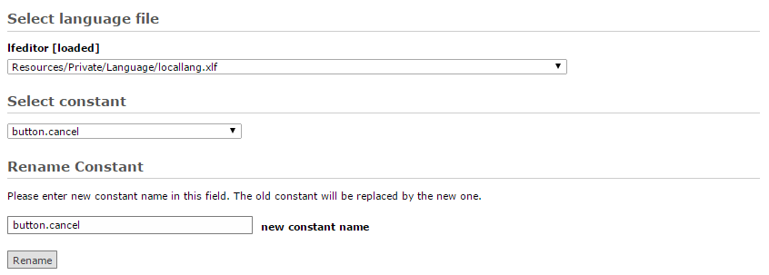

.. ==================================================
.. FOR YOUR INFORMATION
.. --------------------------------------------------
.. -*- coding: utf-8 -*- with BOM.

Rename Constant
---------------

This option serves for renaming the key of existing language constant.
Constant to rename is chosen from select list, and then new name is entered in text field.

