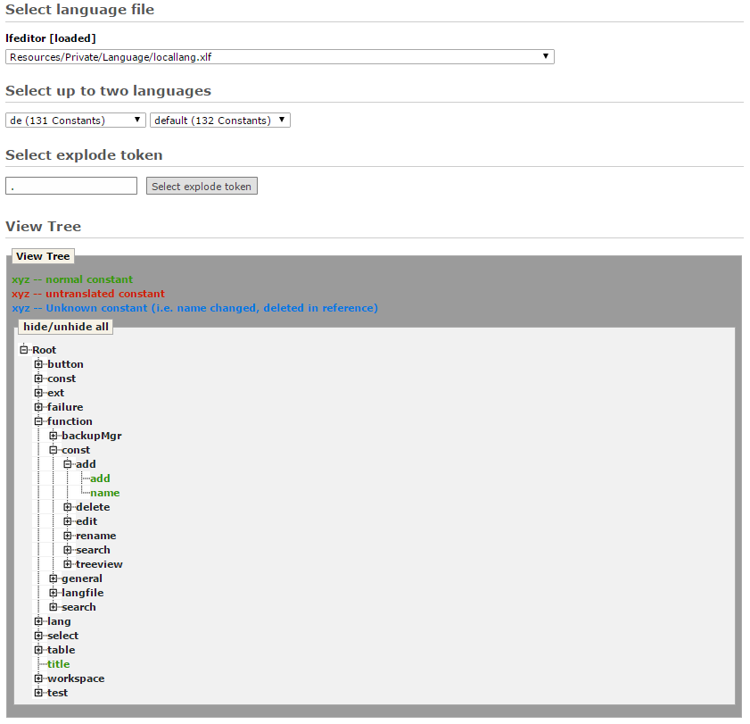

.. ==================================================
.. FOR YOUR INFORMATION
.. --------------------------------------------------
.. -*- coding: utf-8 -*- with BOM.

View Tree
---------

This option serves for overview and easier access to constants.
It displays all constants of language file arranged in a tree.
Constants are displayed as leafs of the tree, and they are colored in three colors which indicate translation state
of each constant for selected language (language from first select box).
The state is calculated in same way like on :ref:`General <general-reference>` page. Constants are compared to language from second select box,
resulting in three states:

- green - normal constant (translated in both languages)
- red - untranslated constant (translated only in second language)
- blue - unknown constant (translated only in first language)

Clicking on tree leaf (last segment of constant key) redirects to :ref:`Edit Constant <edit-constant-reference>` page.

