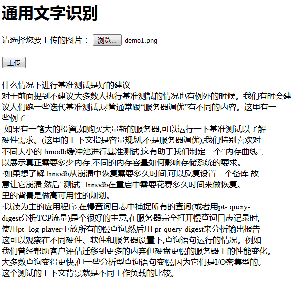
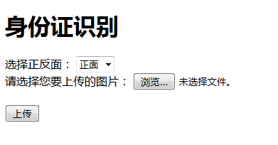
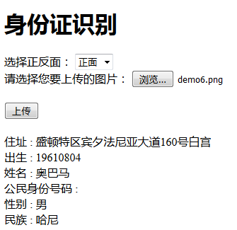

# BaiduOcr
使用PHP来接入百度文字识别和图像识别来实现一些简单的功能

页面如下：

实现的功能有：

* 文字识别
* 图像识别

文字识别的功能有：

* 通用文字识别
* 通用文字识别（高精度）
* 网络图片文字识别
* 身份证识别
* 银行卡识别
* 驾驶证识别
* 行驶证识别
* 车牌识别
* 营业执照识别
* 通用票据识别
 
图像识别的功能有：

* 菜品识别
* 车辆识别
* logo商标识别 
* 动物识别
* 植物识别

### 前提
需要先去注册百度云，并且创建好文字识别应用

地址：https://cloud.baidu.com/product/ocr

然后把创建好应用的appid,appkey和secretkey写入到config.php即可

### 使用方法
放到网站根目录下，访问index.html即可

### 通用文字识别

比如点击通用文字识别，上传图片后如下：

### 身份证识别

比如点击身份证识别，页面如下：

上传身份证图片之后，就可以识别身份证了：

注意：由于时间有限，前端页面比较粗糙，将就了。