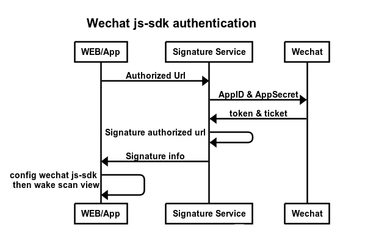

<p align="center"><a href="https://gitee.com/sense7/signature-wx-js-sdk/blob/master/LICENSE"></a></p>  
# signature-wx-js-sdk

#### Description
微信接入js-sdk请求授权获得签名接口

#### Sequence diagram  
  


#### Installation

1. git clone  https://gitee.com/sense7/signature-wx-js-sdk.git

#### Instructions

config **appId** & **appSecret** in *signature.php*
```php
$appId = 'wxd0803523dcadc007';
$appSecret = '6413fed34058b3f6465ac07112cb96ca';
```

## Use in nodejs

install axios
```console
> npm install axios
```

install wx-js-sdk
```console
> npm install weixin-js-sdk
```

define axios in main.js
```javascript
import axios from 'axios'
Vue.prototype.$axios = axios;
```

use in code
```javascript
var authUrl = 'http://www.stanwind.com/demo/'

this.$axios.get('http://localhost/signature.php?url=' + authUrl).then(redata => {
    var data = redata.data;
    wx.config({
      debug: false, 
      // 开启调试模式,调用的所有api的返回值会在客户端alert出来，若要查看传入的参数，可以在pc端打开，参数信息会通过log打出，仅在pc端时才会打印。
      // 必填，公众号的唯一标识
      appId: data.appId, 
      // 必填，生成签名的时间戳
      timestamp: data.timestamp, 
       // 必填，生成签名的随机串
      nonceStr: data.nonceStr,
      // 必填，签名
      signature: data.signature,
       // 必填，需要使用的JS接口列表，所有JS接口列表
      jsApiList: ['checkJsApi', 'scanQRCode'] // 必填，需要使用的JS接口列表
    });
});

wx.error(function (res) {
    console.log('wx error->' + res.errMsg);
});

wx.ready(function () {
    wx.checkJsApi({
        jsApiList: ['scanQRCode'],
        success: function (res) {
            console.log('check js api -> ' + res.errMsg);
        }
    });

    //微信方式
    wx.scanQRCode({
        needResult: 1, // 默认为0，扫描结果由微信处理，1则直接返回扫描结果，
        scanType: ["barCode"], // ["qrCode","barCode"]  可以指定扫二维码还是一维码，默认二者都有
        success: function (res) {
          var result = res.resultStr; // 当needResult 为 1 时，扫码返回的结果
          //alert("扫描结果："+result);
          console.log(result);
          var isbn = result.split(',')[1];
          alert(isbn);
        }
    });
}); 
```

## Test API

http://www.stanwind.com/wx/signature.php?url=http://www.stanwind.com/demo

Demo Response
```json
{
  appId: "wxd0803523dcadc007",
  timestamp: 1551237888,
  nonceStr: "wantongtest",
  signature: "565194473ed71928f8ac9ac7e40561ae31bff993",
  ticket: "LIKLckvwlJT9cWIhEQTwfC_L_JPglkNAJ6HDVuhbwpN-RbVVBcZib8sfe0I3to39DU1LiO5V4hwqIE3cepb51g",
  url: "http://www.stanwind.com/demo",
  code: "0"
}
```

#### Contribution

1. Fork the repository
2. Create Feat_xxx branch
3. Commit your code
4. Create Pull Request


#### Gitee Feature

1. You can use Readme\_XXX.md to support different languages, such as Readme\_en.md, Readme\_zh.md
2. Gitee blog [blog.gitee.com](https://blog.gitee.com)
3. Explore open source project [https://gitee.com/explore](https://gitee.com/explore)
4. The most valuable open source project [GVP](https://gitee.com/gvp)
5. The manual of Gitee [https://gitee.com/help](https://gitee.com/help)
6. The most popular members  [https://gitee.com/gitee-stars/](https://gitee.com/gitee-stars/)