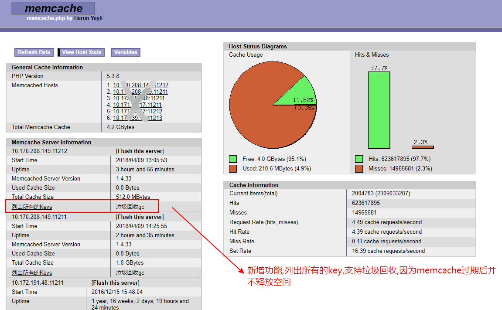

# php-ico-cache php依赖注入缓存

依赖注入缓存 php >= 5.3.0 因为5.3支持匿名函数,项目里有使用匿名函数

采用依赖注入方式实现缓存,易于扩展,只需要继承StoreAbstract

使用igbinary进行高效序列化,gzcompress,zip压缩

提供memcache图形管理

支持file,memcached,redis存储

## 条件
- 必须安装memcached服务[http://memcached.org/](http://memcached.org/)
- 安装php pecl memcached[http://pecl.php.net/package/memcached](http://pecl.php.net/package/memcached),而非memcache扩展
- 安装igbinary可提高memcached性能,libmemcached


## 更新日志 2018-05-03
[更新日志v1.1.0](CHANGELOG.md)

## 文件列表
- autoload.php 注册自动加载函数,加入项目只需此文件即可
- src/Cache.php 缓存入口类及注册
- src/MCache.php 快捷操作memcache类
- src/CacheContainer.php 依赖注入容器
- src/CacheManager.php 缓存服务管理
- src/StoreAbstract.php 存储抽象类
- src/FileStore 文件存储引擎
- src/MemcacheConnector memcache实例单例对象
- src/MemcacheStore memcache存储引擎
- src/MemcachedConnector memcached实例单例对象
- src/MemcachedStore memcached存储引擎
- src/MemcacheGc memcache垃圾回收机制
- src/RedisConnector redis实例单例对象
- src/RedisStore redis存储引擎
- test/* 提供更多实例
- test/config.php 标准配置文件
- test/memcache-tools.php 提供memcache图形管理

## 注册缓存
```php
require 'autoload.php';
use SgIoc\Cache\Cache;
Cache::register();
```

## 快捷操作
- Cache::get();是默认的缓存对象,可以Cache::store切换不同的引擎 
- FCache::get();文件缓存操作
- MCache::get();memcache缓存操作
- DCache::get();memcached缓存操作
- RCache::get();redis缓存操作

## 支持原生对象的方法调用
- 如RedisStore里没有提供lpush方法,但phpredis扩展里有,只需RCache::lpush(key,value)即可.其它缓存一样支持 

## 获取引擎的实例
- Cache::link();获取默认的引擎实例
- RCache::link('redis');获取redis引擎实例 

## put 写入缓存,保存时间10分钟,也支持匿名写法
```php
#普通用法
Cache::put('key', 'data', 10);
#匿名写法
Cache::put('key', function(){
    return 'abc';
}, 10);
```

## get 获取缓存
Cache::get('key');

## remember 写入和获取集成写法,支持匿名函数
```php
#普通写法
$data = Cache::remember("key", 10, "data");
#匿名函数写法 
$data = Cache::remember("key", 10, function(){  
    return '1234567890';
});
```

## forget 删除缓存
Cache::forget('key')

## flush 清除所有的缓存
Cache::flush()

## 切换不同引擎缓存操作
- Cache::store('memcache')->get('key');
- 系统提供一种快捷操作:
- MCache::get('key') 相当于上面的代码

## 获取当前缓存详情运行情况 
- Cache::info();
- Cache::store('memcache')->info();
- MCache::info();


## 完整实例操作
```php
require 'autoload.php';
use SgIoc\Cache\Cache;

//缓存配置
$config = array(
    'file'     => array(//文件存储引擎
        'expired'   => 7200,//默认存储时间
        'path'      => __DIR__ . '/storage/',//存储目录,必须可写
        'is_zip'    => 1,//是否开启压缩
        'zip_level' => 6,//压缩等级0~10
    ),
    'memcache' => array(//memcache存储引擎
        'host' => '127.0.0.1',//memcache地址
        'port' => 11211,//memcache端口
    ),
);

try {
    //注册缓存
    Cache::register($config);
    //键
    $key = 'key-simple';
    //值
    $str = str_repeat(join(',', range('a', 'z')), 1) . '<br/>' . date('H:i:s');
    //判断缓存是否存在
    if(!Cache::has($key)) {
        //写入缓存
        Cache::put($key, $str);
    }
    //读取缓存
    $res = Cache::get($key);
    dump($res);
    //删除缓存
    $bool = Cache::forget($key);
    dump($res);
} catch (Exception $ex) {
    dump($ex->getMessage());
}
```


## 更多实例
- [常用操作](test/exa-simple.php)
- [写入缓存 put($key, $value, $minutes)/add($key, $value, $minutes)](test/exa-add-put.php)
- [读取缓存 get($key)/pull($key)](test/exa-get-pull.php)
- [判断缓存是否存在 has($key)](test/exa-has.php)
- [永久缓存 forever($key, $value)](test/exa-forever.php)
- [写入&读取 remember($key, $minutes, $value)](test/exa-remember.php)
- [永久写入&读取 rememberForever($key, $value)](test/exa-rememberForever.php)
- [递增 increment($key, $step)](test/exa-increment.php)
- [递减 decrement($key, $step)](test/exa-decrement.php)
- [删除缓存 forget($key)](test/exa-forget.php)
- [清除所有缓存](test/exa-flush.php)
- [切换引擎 store($engine)](test/exa-store.php)
- [MCache MCache::get](test/exa-mcache.php)
- [使用外部配置文件](test/exa-config.php)
- [扩展缓存](test/exa-extends.php)
- [注册独立缓存](test/exa-register.php)
- [垃圾回收](test/exa-gc.php)
- [memcache图形管理](test/memcache-tools.php)

## 知识要点
- 依赖注入(DI) & 控制反转(IOC)
- 延时静态绑定
- 匿名函数应用
- 抽象 & 继承
- 单例实现
- __callStatic & call_user_func_array

## 图形管理


## 更多技术支持
- [更关作者的www.sgfoot.com网站](http://www.sgfoot.com)