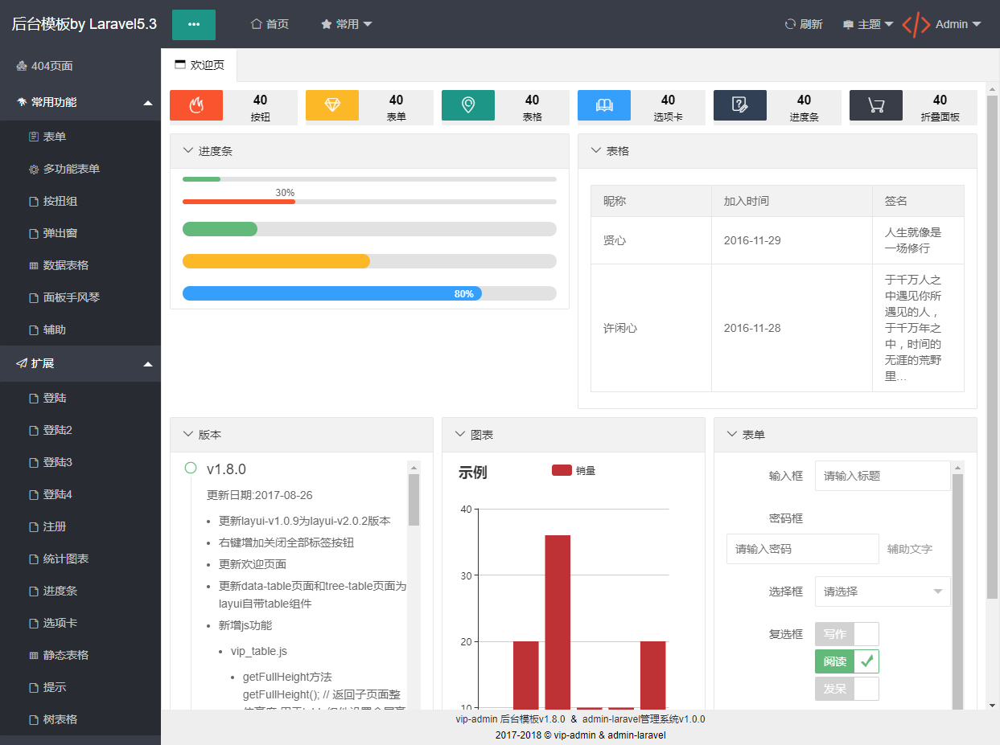
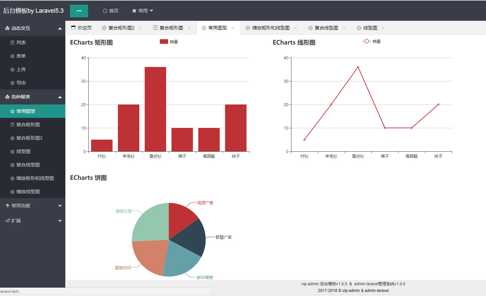

# Admin-Laravel 后台管理框架
- 由laravel5.3,vip-admin1.8.0框架实现

## 了解更多技术支持
[作者技术小站,欢迎光临](http://www.sgfoot.com)

## 技术支持
- [laravel5.3](http://laravelacademy.org/laravel-docs-5_3)
- [vip-admin1.8.0](http://vip-admin.com/product/1.html)
- [layui2.2.6](http://www.layui.com/)


##安装
```bash
git clone https://gitee.com/sgfoot/laravel_admin.git
cd laravel_admin
composer update
cp .env.example .env
php artisan key:generate
php artisan serve #启动laravel服务器


若是linux 需要给足权限
chmod -R 777 storage/
chmod -R 777 bootstrap/cache/
chmod -R 777 public/logs/
chmod -R 777 public/uploads/
```

## 在线演示
[admin-laravel.sgfoot.com](http://admin-laravel.sgfoot.com)

## 效果图




## 实用的动态数据操作
- 动态交互/列表
- 动态交互/表单
- 动态交互/上传
- 动态交互/导出


## 前端补充插件
- jquery.particleground.min.js 微粒子特效插件
- supersized.3.2.7.min.js 动态背景切换全屏插件

## composer by laravel补充插件
- mews/captcha 验证码
- ixudra/curl curl插件
- phpoffice/phpexcel phpexcel插件
- simple-qrcode 生成二维码插件

## 日志自定义插件说明
- mylog日志函数,文件生成目录定义更改app/helper.php 常量SGLOGS_PATH
- 查看方式在http://localhost/logs/
- 时光日志源码: [https://gitee.com/sgfoot/sglogs](https://gitee.com/sgfoot/sglogs)

## 扩展Plugin
- app/Plugin/ExpressHelp.php 快递类
- app/Plugin/PHPExcelHelp.php excel帮助类
- app/Plugin/SgLogs.php 时光日志类
- app/Plugin/WxHelp.php 微信辅助类
- app/Plugin/WxJssdk.php 微信jssdk类

