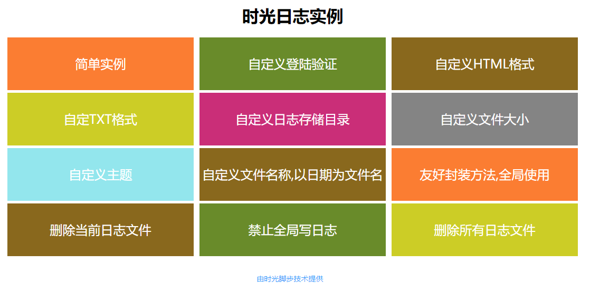
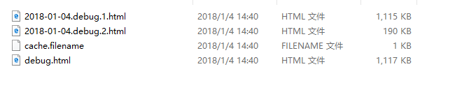
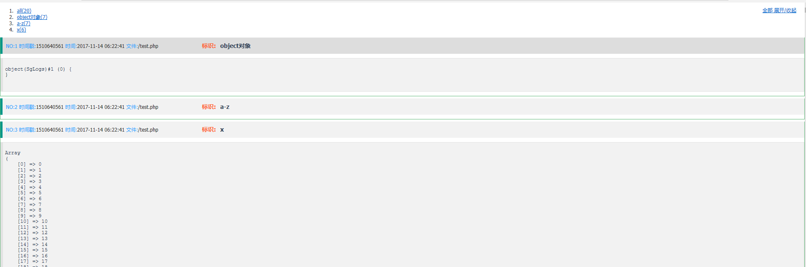
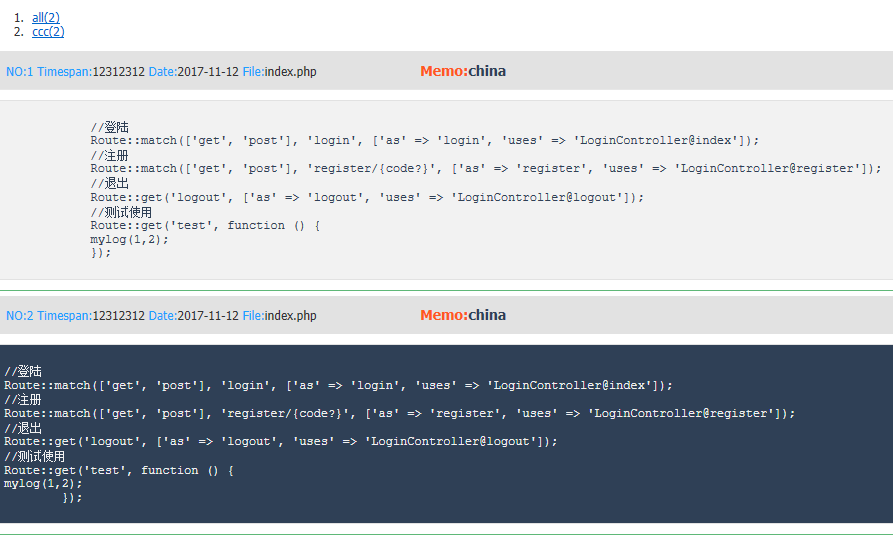

# sglogs -时光日志v2.0
- 一款以HTML形式展示的日志,并加入访问验证,加强日志安全(2018/07/5新增功能)
- 可自定义目录,格式,自动生成新文件,全局禁止,删除所有文件
- 不限日志大小,每个文件最大为5M,超出则生成子文件
- 实用于php,其它语法可改写
- 支持主题切换
- 兼容手机查看

#composer 安装
- composer require sgfoot/sglogs

## DEMO在线实例
[时光日志](http://sglogs.sgfoot.com/)



## 升级日志
* 更新日期:2018/08/10
[升级v2.1](CHANGE.md)


## 要求:
 - 大于等于php5.1.0
 - 设置日志目录可写,linux: chmod -R 777 var/logs

## nginx 站点配置
```bash
location /logs/ {
                autoindex on;
                autoindex_exact_size off;
                autoindex_localtime on;
                break;
        }

```
## 文件目录 
```html
时光日志目录结构
| 
|-- index.html
|-- README.md
|-- CHANGE.md
|-- lib
|   |-- SgLogs.php
|-- logs
`-- example
    |-- delete-all
    |-- delete-curr.php
    |-- disable-write.php
    |-- func.php
    |-- self-date.php
    |-- self-dir.php
    |-- self-html.php
    |-- self-size.php
    |-- self-theme.php
    |-- self-txt.php
    |-- simple.php
    |-- verify.php
```

## 使用方法:

### 1.简单使用
```php
require('SgLogs.php');
$data = range(1,10);
SgLogs::write($data, 'data数据');
```
### 2.自定义日志目录 
```php
require('SgLogs.php');
define('SGLOGS_PATH', __DIR__ . '/logs/');
$data = range(1,10);
SgLogs::write($data, 'data数据');
```

### 3.自定义格式,支持php, html,txt,默认php,人性化浏览
```php
require('SgLogs.php');
define('SGLOGS_PATH', __DIR__ . '/logs/');
define('SGLOGS_TYPE', 'txt');

$data = range(1,10);
SgLogs::write($data, 'data数据');
```

### 4.设置文件大小,默认5m,若文件大于5m,则自动新增一个文件;若设置为0表示不新增
```php
require('SgLogs.php');
$data = range(1, 10000);
define('SGLOGS_PATH', __DIR__ . '/logs/');
define('SGLOGS_MAX', 5);
$bool = SgLogs::write($data, 'data');
```

### 5.手动清除日志,第三个参考:true表示清除,all表示删除所有的文件
```php
require('SgLogs.php');
$data = range(1,10);
SgLogs::write($data, 'data数据', true);
SgLogs::write(1, 'clear', 'all');
```

### 6.友好封闭,全局使用
```php
//将下面两行代码,放在你程序启动的文件里
include_once('SgLogs.php');
define('SGLOGS_PATH', __DIR__ . '/logs/');

//下面方法放在公用文件里,全局地方可以调用
function mylog($data, $flag, $flush = false)
{
    SgLogs::write($data, $flag, $flush);
}
```

### 7.禁止所有日志写入使用
```php
include_once('SgLogs.php');
define('SGLOGS_MODE', 0)
```

### 8.删除所有的debug文件
```php
include_once('SgLogs.php');
SgLogs::write(1, 'clear-all', 'all');
```

### 9.切换不同的主题,默认default
```php
define('SGLOGS_THEME', 'white');//底色为灰色
define('SGLOGS_THEME', 'default');//底色为黑色
```

### 10.自带函数,全局操作
```angular2html
sglogs('数据', 'flag')
```

## 效果图

* 文件显示图例



* 日志html显示图例



* 不同主题显示图例

