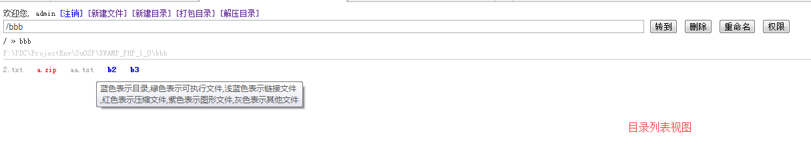
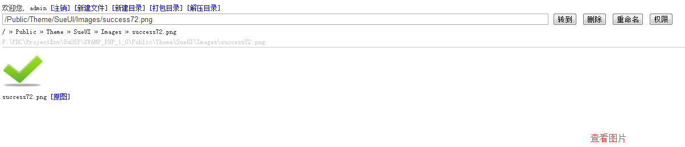
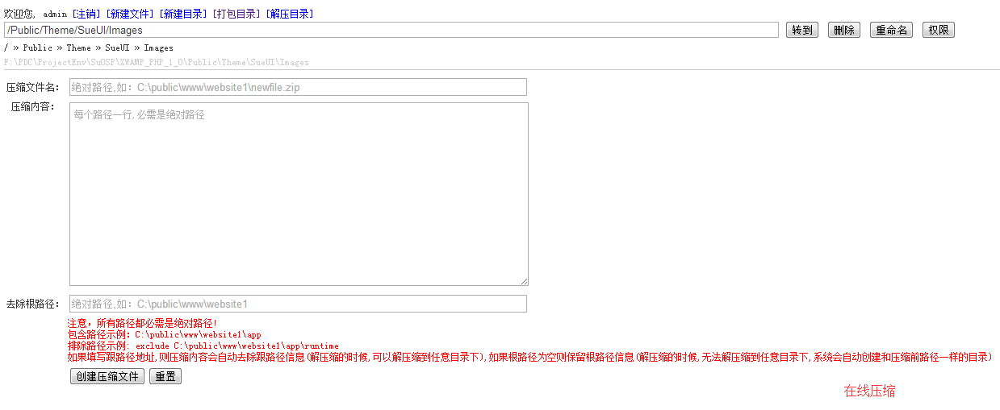

#SuExplorer_PHP_3_2

**前言：** 
项目开发过程中，网站一般部署到远程服务器，所以文件管理就不能和本机操作一样方便。通常文件管理是用ftp下载到本地，修改后再上传，或者远程登录到服务器进行修改。但是这些操作都依赖于复杂的第三方软件。如果只是想简单修改网站中一个页面中的文字，或查看文件代码，相对于繁琐的使用第三方软件进行操作的流程，如果有一个小程序能在线操作文件，那就能方便快速达到自己的需求了。所以，SuExplorer就是在这样的需求中被开发出来。 
秉承自己开发的小工具一贯的风格，首先是要尽可能绿色单文件，尽量不依赖其他文件，然后是容易部署。 这样才能方便在项目中提高生产力! 
**简介：** 
SuExplorer_PHP是一个用于在线管理文件的单文件绿色版PHP程序，和phpinfo.php一样可以方便放到项目中使用。
开发项目过程中，操作服务器上的文件是一个费时费力的流程，如果有一个通用管理程序，可以很简单而高效地管理服务器上的文件，那对项目的开发效率肯定有明显的提升，可以减少很多重复而单调的体力劳动。但是，管理服务器上的文件，首先要连接上服务器，然后用第三方工具进行操作，为了简单查看一下文件源码，却要安装一大堆不需要的依赖文件，而且还要开启和关闭第三方软件，效率有点低。于是决定自己抽出一点时间来开发一个自己用起来顺手的在线文件管理小工具，简单而高效，用起来还顺手~ 
**特性：** 
1、单文件绿色版，无外部依赖，方便部署使用
2、支持登录验证
3、支持内置配置文件，使用更灵活
**功能：** 
1. 在线创建文件或目录 
2. 在线删除文件或目录 
3. 在线重命名文件或目录 
4. 在线编辑文本文件 
5. 在线上传文件 
6. 在线压缩 
7. 在线解压缩 
**使用：** 
1. SuExplorer_3_1文件复制到您的项目中任意目录(本文件为单文件绿色版,方便使用). 
2. 修改配置内容为适合您需要的规则. 
3. 运行本文件, 开始在线管理文件~ 
 
项目主页：http://git.oschina.net/sutroon/SuExplorer_PHP_3_0 
交流博客：http://www.cnblogs.com/sutroon/p/4744779.html 
 
**快照：** 
  
  
  
  
  