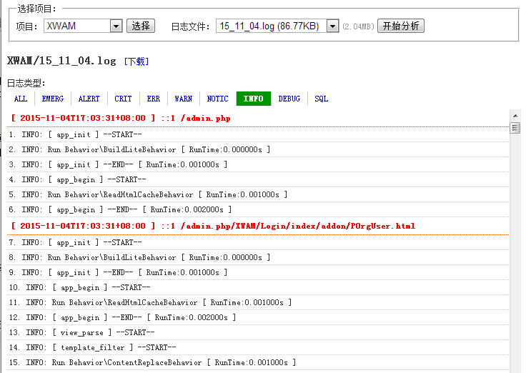

#TPLogAnalysis_PHP_1_0

**前言：** 
项目开发基于ThinkPHP框架，但是在调试程序的时候，没有一款日志可视化分析工具。在网络也找不到任何相关的TP日志分析工具。求人不如求己，于是决定抽出一点时间，开发一个符合自己需要的TP日志分析工具。 
秉承自己开发的小工具一贯的风格，首先是要尽可能绿色单文件，尽量不依赖其他文件，然后是容易部署。 这样才能方便在项目中提高生产力! 
 
**简介：** 
TPLogAnalysis_PHP是一个用于在线分析ThinkPHP日志的单文件绿色版PHP程序，和phpinfo.php一样可以方便放到项目中使用。 
项目开发基于ThinkPHP框架，但是在调试程序的时候，没有一款日志可视化分析工具。在网络也找不到任何相关的TP日志分析工具。求人不如求己，于是决定抽出一点时间，开发一个符合自己需要的TP日志分析工具。 
 
**特性：** 
1、单文件绿色版，无外部依赖，方便部署使用 
2、支持多个数据库切换 
3、支持内置配置文件，使用更灵活 
 
**使用：** 
1. TPLogAnalysis_PHP_1_0文件复制到您的项目中任意目录(本文件为单文件绿色版,方便使用). 
2. 修改配置内容为适合您需要的规则. 
3. 运行本文件, 开始Redis调试~ 
 
项目主页：https://git.oschina.net/sutroon/TPLogAnalysis_PHP_1_0.git 
交流博客：http://www.cnblogs.com/sutroon/p/4994552.html 
 
**快照：** 
 
